# AutoWork

**Your digital coworker.** An autonomous desktop assistant that organises your files, builds
professional documents, and runs multi-step workflows — on your own machine, inside a sandbox
you define.

Built with .NET 10 and Avalonia UI. Runs on Windows, macOS and Linux.

> 🇮🇩 **Bahasa Indonesia:** [README.id.md](README.id.md) · Dokumentasi lengkap di [docs/id](docs/id)

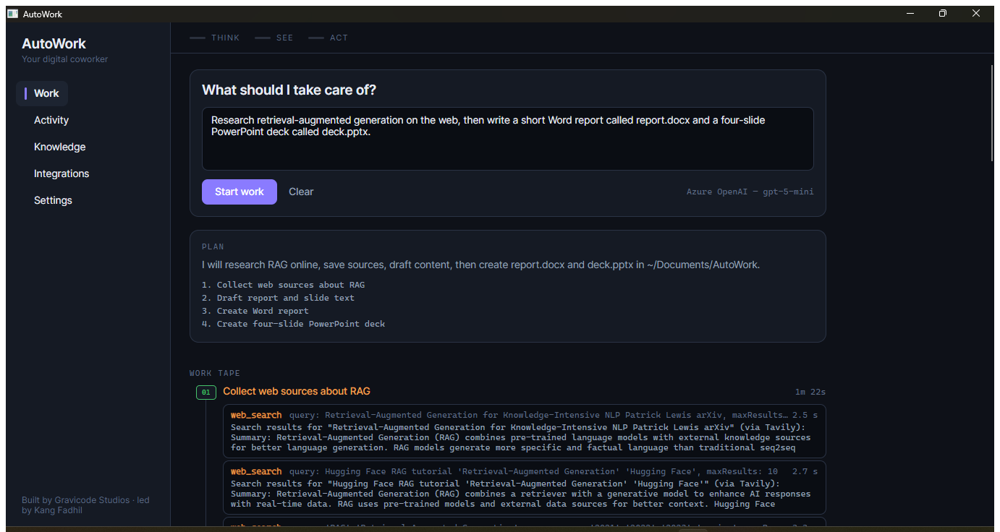

---

## What it does

AutoWork takes a request in plain language, plans it, does it, and then checks its own work.

```
"Read every invoice PDF in ~/Documents/Invoices, pull out the vendor,
 date and total, and build me an Excel summary with a grand total."
```

It reads the PDFs, extracts the figures, writes a real `.xlsx` with live formulas, and tells
you exactly what it produced — while every step is visible as it happens and recorded in a log
you can audit afterwards.

## The architecture

AutoWork is built as three cooperating subsystems. This is not a metaphor — it is how the code
is organised, and every action in the interface is attributed to one of them.

| Subsystem | What it is | What it does |
|---|---|---|
| **Brain** (Think) | `AutoWork.Agents` | Plans multi-step work, reasons, recovers from failures, summarises its own context when the window fills, and verifies the result before claiming success. |
| **Eyes** (See) | `AutoWork.Tools` + vision model | Captures the screen, reads dialogs, tables and small text that are not available as files. |
| **Hands** (Act) | `AutoWork.Tools` | Files, shell, documents, data, images, synthetic input, and the network — everything that touches the machine. |

## Features

**Autonomous execution.** Give it a goal; it produces a plan with checkable success criteria,
works through it step by step, recovers from tool failures, and verifies the outcome. Progress
streams live onto the *Work Tape* — a stamped, numbered timeline of everything it did.

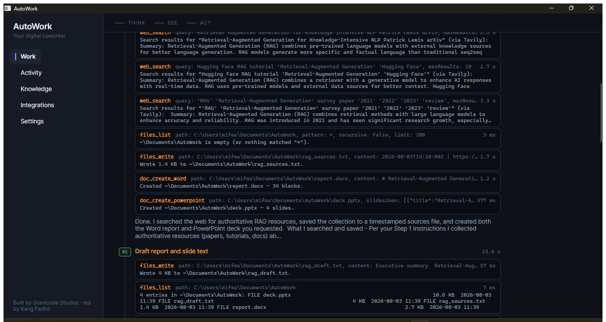

Every tool call is shown with the arguments it was given, what it returned and how long it took.
Nothing happens that you cannot see afterwards.

**Direct local file access.** Read, write, move, copy, rename. Batch rename with regular
expressions and organise folders by type, extension or date — always with a dry-run preview
before anything moves.

**Professional documents.** Excel workbooks with live formulas, Word documents, PowerPoint
decks, PDFs, and OpenDocument files for LibreOffice. Generated through real OOXML and ODF rather
than by asking a model to emit XML, and opened by the real applications — not just accepted by a
validator. It also converts any document it can read into Markdown, and fills `.docx` templates
with `{{placeholders}}`, telling you which ones you left empty rather than shipping a document
with holes in it.

Below: one job — *"research retrieval-augmented generation on the web, then write a short report
and a four-slide deck"* — run against DeepSeek, and the two files it produced, opened in Word and
PowerPoint.

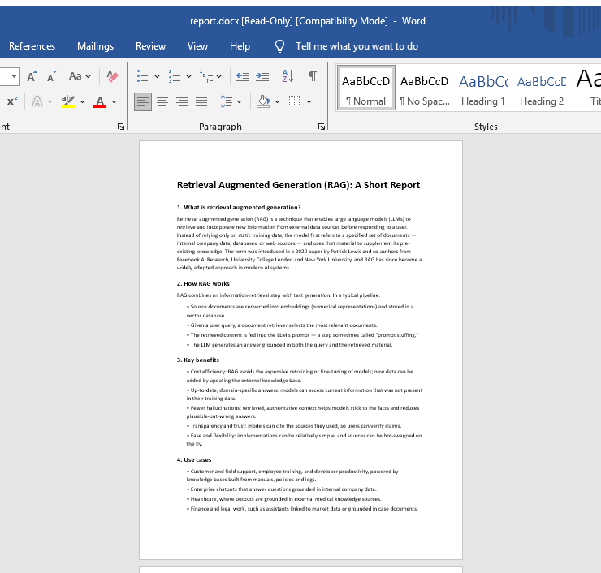

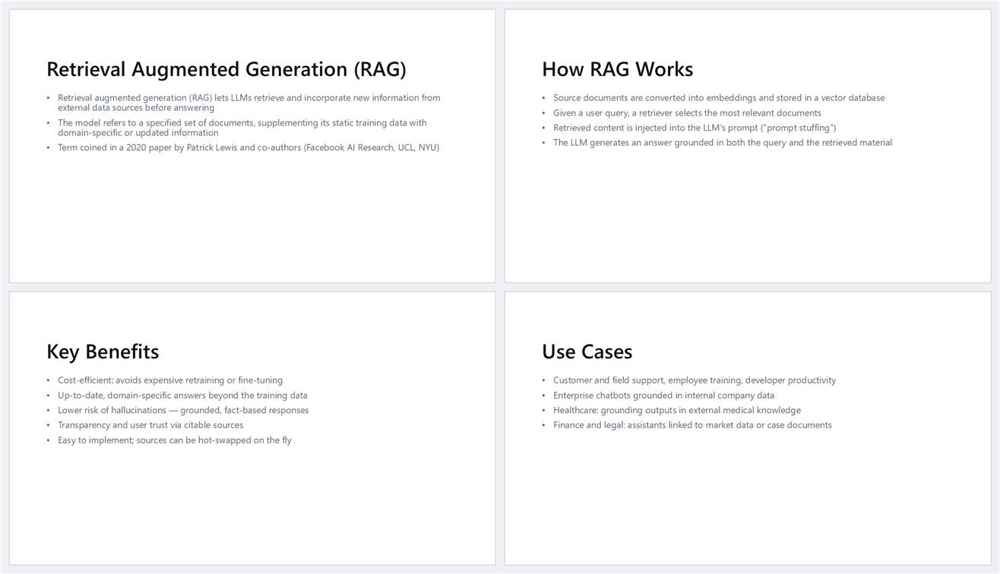

**Data extraction.** PDF text, CSV profiling (column types, ranges, null counts) and cleaning.
Profiling first means the model reasons about a *summary* of 50,000 rows rather than drowning
in them.

**Web research.** Search the internet and read the results. Tavily when you supply a key,
DuckDuckGo and Wikipedia when you do not — so research is not a paid feature.

**A browser you are signed in to.** Fetching a URL gets you the page a stranger sees; most of
what people want automated is behind a login. So AutoWork can drive a real browser — the Edge or
Chrome you already have, nothing to download — against a profile of its own that stays signed in
between runs. It reads pages, lists what can be clicked, fills fields and clicks things by their
visible text. It is off by default, separate from ordinary network access, and asks before every
navigation and click, because on those sites it is acting as you.

**Work that repeats itself.** Save a job and have it run every Monday morning, or whenever a
folder changes. A scheduled run happens in the Work view exactly as if you had typed it — same
plan, same consent cards, same history — so a job you leave running behaves like one you watched.
Missed time never piles up: an app closed over the weekend wakes owing nothing.

**Meetings.** Point AutoWork at a recording and it turns it into text, then pulls out the
decisions and who owes what. The speech model runs **on your computer** — AutoWork ships none and
uses whichever one you already have — so recordings of other people do not leave your machine
unless you explicitly choose a service instead.

**Replies as they are written.** Long reasoning appears on the Work Tape as it forms, rather than
arriving in a block once the step is over. A provider that cannot stream falls back to waiting.

**Sub-agent coordination.** Genuinely independent steps run in parallel, each with its own
context, so their token use does not compound.

**Auto-compaction.** When a long run approaches the model's context window, older turns are
summarised away automatically — carefully, never splitting a tool call from its result.

**Pause and steer.** Spotted it going the wrong way? Pause, type what you actually meant, and let
it carry on — instead of cancelling and re-typing the whole job.

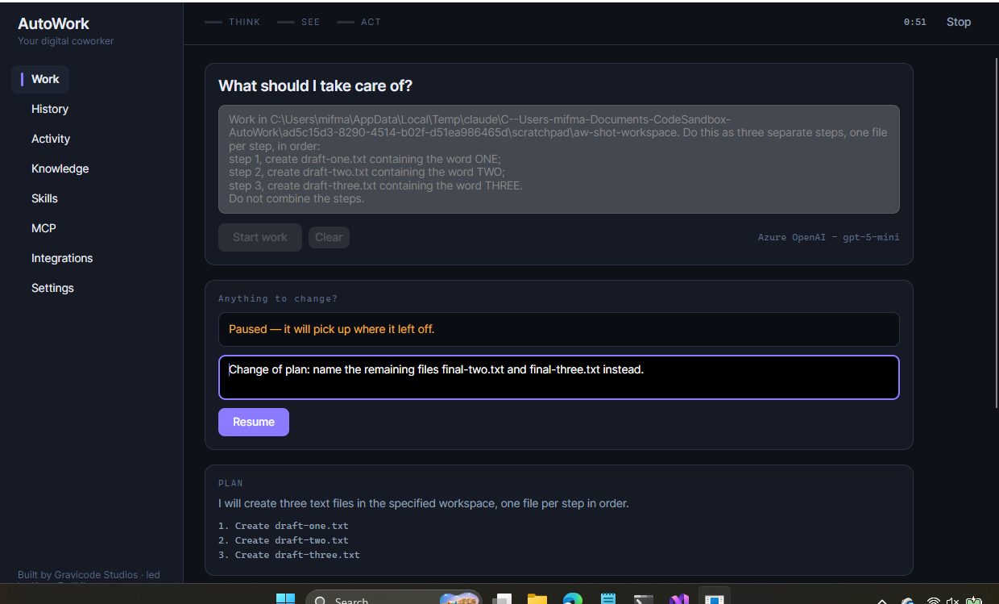

The pause lands at the next step boundary rather than mid-action, so nothing is left half-written,
and your correction goes to the model *before* the step it is meant to change. You can also send a
correction without pausing at all; it is applied at the next boundary either way.

**Run history.** Every run is kept: what you asked for, the plan, every tool call and what it
returned.

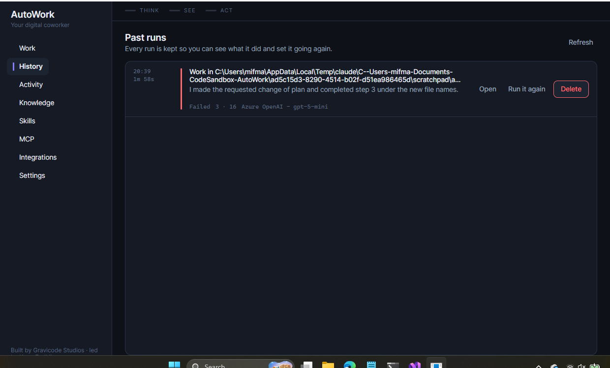

Reopen one and it replays onto the Work Tape exactly as it looked while it was happening — the
screenshot below is a fresh launch of the app reading a finished run back off disk — or set the
same job going again with one click.

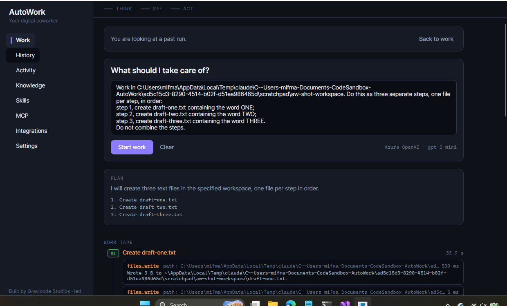

How long runs are kept is yours to set, and the whole thing can be switched off.

**See a change before it happens.** When AutoWork is about to overwrite a file you already have,
the consent card shows the diff — what goes, what arrives — not just a filename and a byte count.

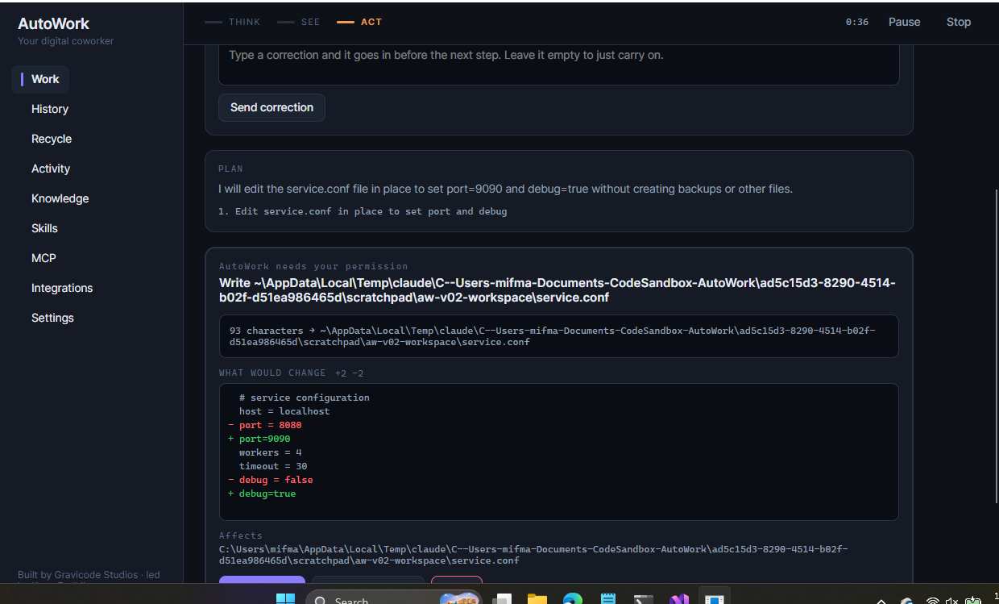

Creating a new file doesn't show one, because "making a file" and "rewriting every line of a
file" should not look the same.

**Standing answers.** "Always allow writes under ~/Projects." "Never allow deletes." Rules
instead of a queue of clicks.

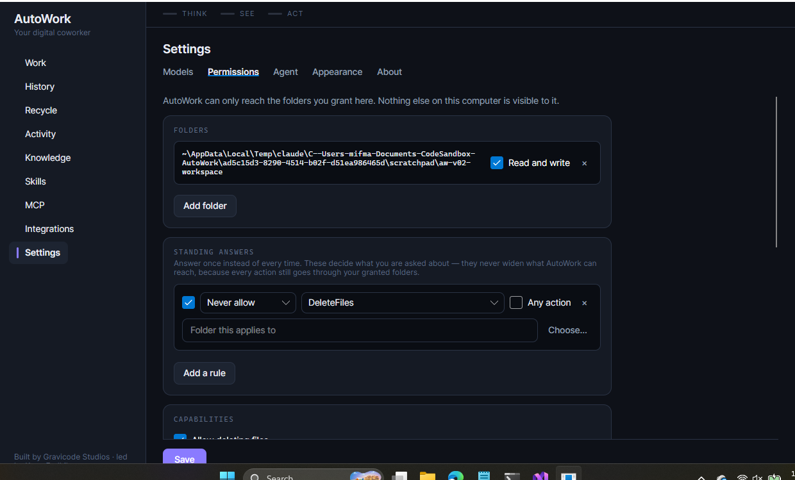

Two things are true of every rule: a *never* always beats an *always*, and a rule only changes
what you are **asked** — never what AutoWork can reach. An allow rule pointing somewhere you
haven't granted still gets refused by the sandbox.

**Deleted files come back.** Anything AutoWork deletes is moved aside, with a record of where it
was, and the Recycle page puts it back.

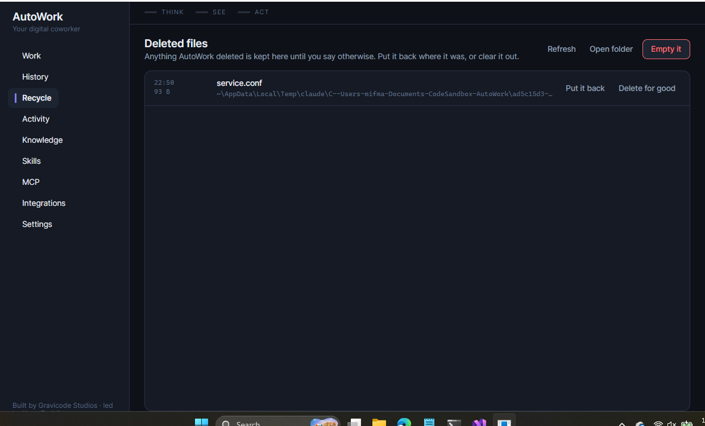

If something is already at that path it tells you and waits rather than replacing your work.

**A meter that doesn't guess.** Every run reports the tokens the provider says it used. Put your
provider's prices in and it reports what the run cost, too.

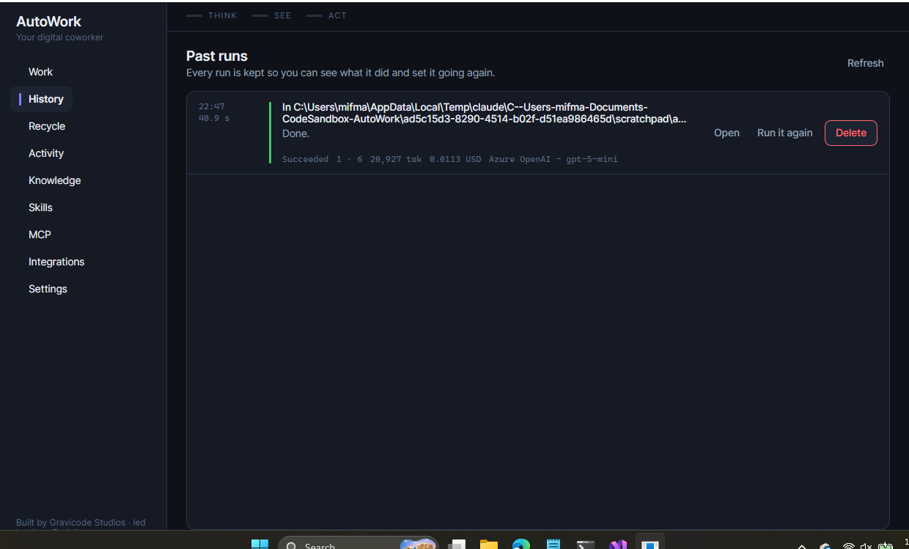

AutoWork ships no price table on purpose: prices move faster than model names, and a stale
built-in figure that under-reports your spend would be worse than showing tokens alone. If a
provider doesn't report usage, the total is shown as "at least" rather than dressed up as exact.

**Knowledge bases.** Topic-scoped memory that survives between sessions, searched by embedding
when an embedding model is configured, and by keyword when one is not. There is also a local
index that needs no model, no key and no network at all — worse at meaning than a hosted model,
better at never leaving your machine. Add notes by hand, or
import Word, PowerPoint, Excel, PDF, CSV, HTML and Markdown files — the file's name becomes the
title and its content becomes the note.

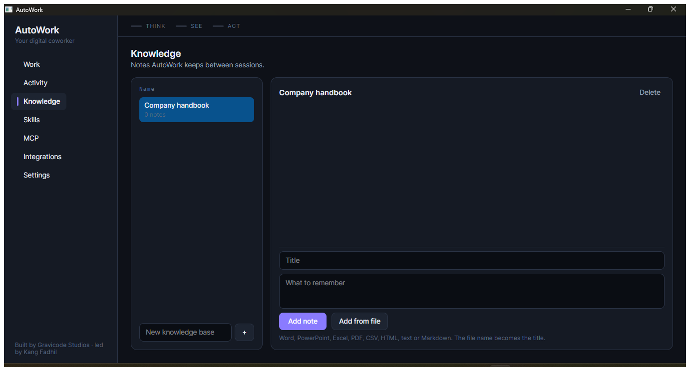

**Skills.** Instructions the agent follows for particular kinds of work, installed from GitHub
repositories you choose. A skill installs as a whole folder — reference documents, templates and
scripts, not just the manifest — because its instructions routinely say "see REFERENCE.md" or
"run scripts/fill.py". Only each skill's name and one-line description sit in the prompt; the
agent opens the rest when the job calls for it, so an unused skill costs almost nothing.

Running a bundled script is code from someone else's repository, so it has its own switch, off by
default, and asks before every run. Libraries the script needs are installed into an environment
belonging to that skill alone — the package list is shown before anything is fetched.

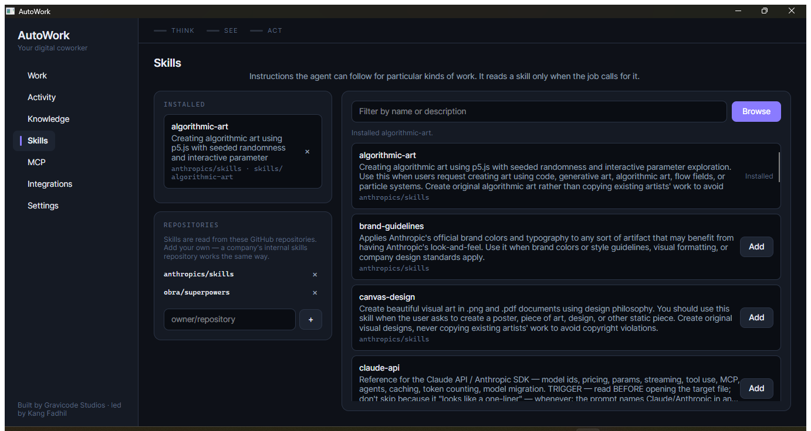

**MCP servers.** Borrow tools from any Model Context Protocol server — a real browser, a docs
index, a vendor's API. The built-in catalogue covers Figma, Canva, Blender, GitHub, Atlassian,
Linear, Asana, Chrome DevTools, Microsoft Learn, Azure DevOps, MarkItDown, AWS documentation and
more. Every entry was read off the vendor's own page rather than a directory listing, and any
entry that is not published by the vendor is labelled as such — "Figma's own server" and
"someone's Figma server" are different things to hand your account to.

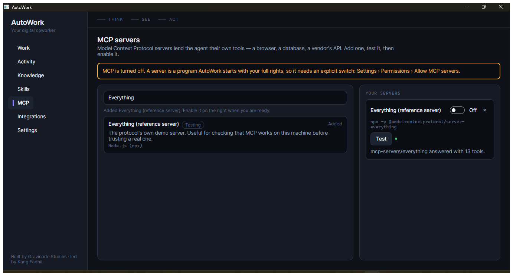

Most MCP servers are in no catalogue, so you can add one by hand: a command and arguments, or a
URL, plus any environment variables the vendor's page asks for. Tokens go to the secret store,
never into `config.json`. Links to the Microsoft, Google, AWS and official collections sit beside
the form for when you want something this list does not carry.

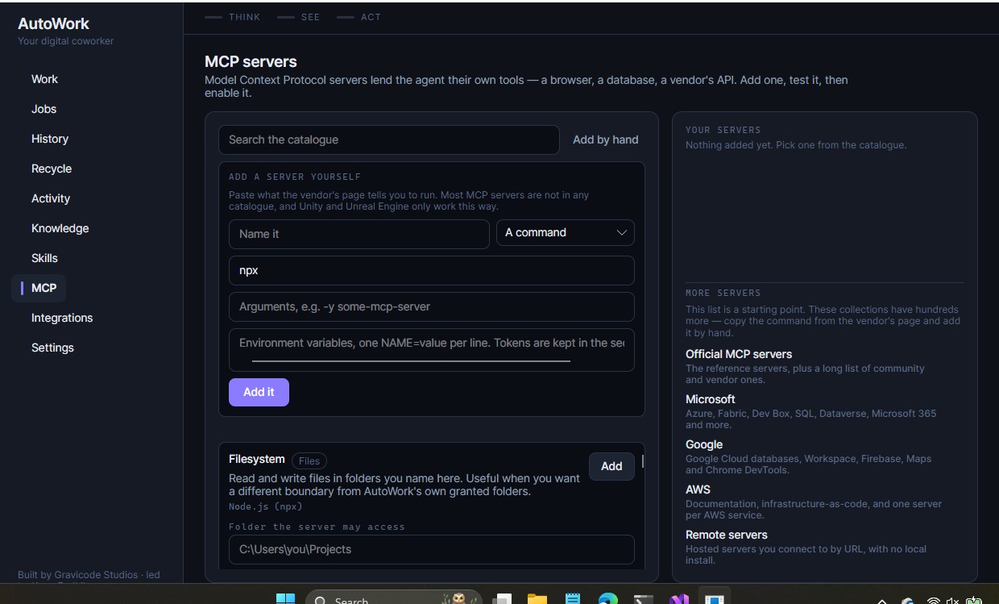

**Any model you like.** OpenAI, Azure OpenAI, Anthropic, Google Gemini, Ollama, DeepSeek, Qwen,
Moonshot, OpenRouter, LM Studio — or any OpenAI-compatible endpoint. Configure in the app, in a
config file, or through environment variables.

**Integrations.** GitHub, Google Drive, Gmail, Notion, Asana and PayPal.

**A real sandbox.** See below — this is the part that matters most.

## Security model

AutoWork's central claim is: **it can only reach the folders you grant it.**

- **Deny by default.** A fresh install can read and write nothing. You grant folders explicitly,
  as read-only or read/write.
- **One chokepoint.** Every filesystem operation passes through `PathGuard`, which canonicalises
  the path, *resolves symlinks*, rejects OS and AutoWork-internal directories, requires
  containment in a granted root, and then applies the denied-pattern list.
- **Symlinks are resolved, not trusted.** A link inside a granted folder pointing at `~/.ssh`
  is refused. This is tested.
- **Credentials are blocked even inside granted folders** — `.ssh`, `.aws`, `.env`, `*.pem`,
  keychains and friends, by default.
- **Dangerous capabilities are opt-in.** Deleting, shell commands, mouse/keyboard control, MCP
  servers and skill scripts are all off until you turn them on, and approval-gated by default
  when you do.
- **Consent is inline and specific.** Requests appear in the flow of the work with the actual
  command or file list shown — not as a modal you learn to dismiss.

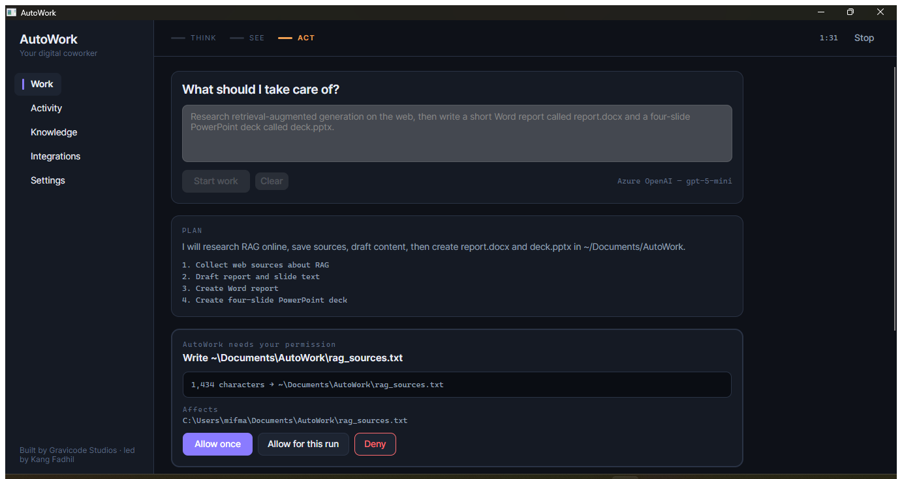

- **Everything is logged.** Every action lands in an append-only JSONL log, visible in the
  Activity view.

**Honest limits.** Input control (synthetic mouse and keyboard) cannot be sandboxed by this
process — once input is synthesised it goes to whatever window has focus. Shell commands run
with your full user privileges. An MCP server is a program AutoWork starts with those same
rights, and `PathGuard` cannot see inside it — which is why it takes its own switch, and why each
server stays disabled until you enable it. A skill's bundled script is the same story: someone
else's code, its own switch, approval before every run. All of these are off by default, and the
controls around them are consent and visibility rather than containment. On Windows the secret store is encrypted with
DPAPI; on Linux and macOS it falls back to owner-only file permissions. See
[docs/en/security.md](docs/en/security.md) for the full picture.

## Install

**Windows**

```powershell
git clone https://github.com/gravicode/autowork.git
cd autowork\install
.\install.ps1 -Desktop
```

**macOS / Linux**

```bash
git clone https://github.com/gravicode/autowork.git
cd autowork/install
chmod +x install.sh && ./install.sh
```

Needs the [.NET 10 SDK](https://dotnet.microsoft.com/download). Full guide:
[docs/en/installation.md](docs/en/installation.md).

## First run

1. **Settings › Models** — add a provider and paste an API key (or point it at a local Ollama).
2. **Settings › Permissions** — grant AutoWork a folder to work in.
3. **Work** — describe a job and press *Start work*.

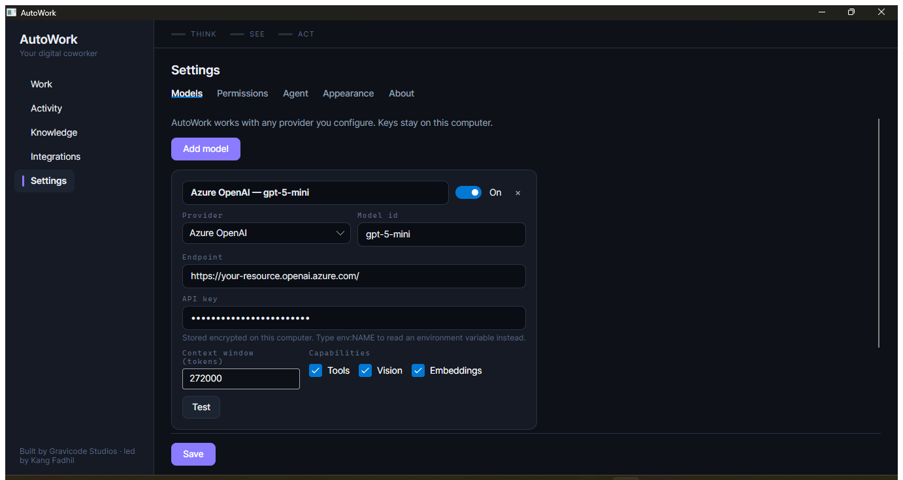

The interface follows your system theme, and you can pin it to light or dark:

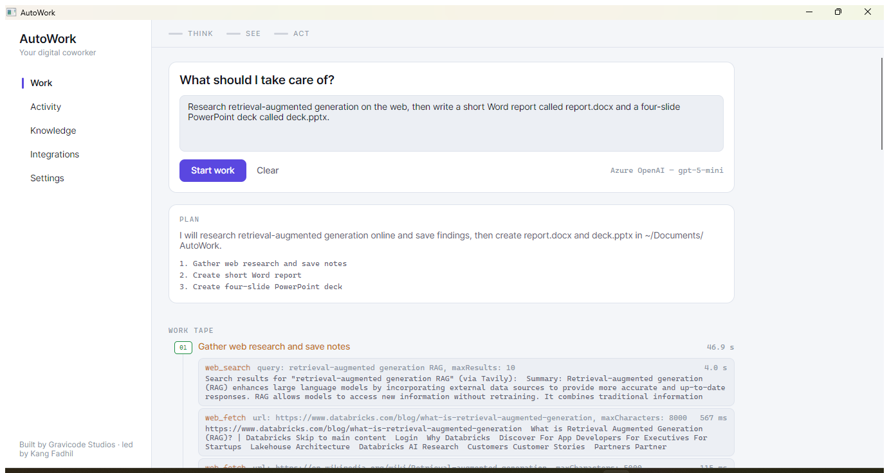

If a provider key is already in your environment (`ANTHROPIC_API_KEY`, `OPENAI_API_KEY`,
`OLLAMA_HOST`, …), AutoWork picks it up on first launch and step 1 is already done.

## Configuration

Three ways, in increasing precedence: **config file → environment variables → the app's UI.**

```bash
export ANTHROPIC_API_KEY=sk-ant-...      # any vendor key is auto-detected
export AUTOWORK_FOLDERS="$HOME/Documents;$HOME/Downloads"
export AUTOWORK_ALLOW_SHELL=false
```

Config lives at `%APPDATA%\AutoWork\config.json` (Windows), `~/.config/AutoWork/` (Linux),
`~/Library/Application Support/AutoWork/` (macOS). API keys are never written to it — only a
reference to the secret store or an environment variable. Full reference:
[docs/en/configuration.md](docs/en/configuration.md).

## Build from source

```bash
dotnet restore AutoWork.slnx
dotnet build AutoWork.slnx
dotnet test tests/AutoWork.Tests/AutoWork.Tests.csproj
dotnet run --project src/AutoWork.Desktop/AutoWork.Desktop.csproj
```

Run a single test:

```bash
dotnet test --filter "FullyQualifiedName~SandboxTests.A_symlink_pointing_out_of_the_granted_folder_is_refused"
```

## Project layout

```
src/
  AutoWork.Core           Config, secrets, permissions, action log, knowledge bases
  AutoWork.Providers      Multi-provider LLM factory, native Anthropic client, embeddings
  AutoWork.Tools          Files, shell, documents, data, images, screen, input, web
  AutoWork.Agents         Orchestrator, planner, sub-agents, context compaction, vision
  AutoWork.Integrations   Connector framework and connectors
  AutoWork.Desktop        Avalonia UI
tests/AutoWork.Tests      xUnit
install/                  Installers and uninstallers
docs/en · docs/id         Documentation, English and Bahasa Indonesia
```

## Documentation

| | English | Bahasa Indonesia |
|---|---|---|
| Installation | [docs/en/installation.md](docs/en/installation.md) | [docs/id/instalasi.md](docs/id/instalasi.md) |
| Configuration | [docs/en/configuration.md](docs/en/configuration.md) | [docs/id/konfigurasi.md](docs/id/konfigurasi.md) |
| Security | [docs/en/security.md](docs/en/security.md) | [docs/id/keamanan.md](docs/id/keamanan.md) |
| Architecture | [docs/en/architecture.md](docs/en/architecture.md) | [docs/id/arsitektur.md](docs/id/arsitektur.md) |
| Integrations | [docs/en/integrations.md](docs/en/integrations.md) | [docs/id/integrasi.md](docs/id/integrasi.md) |
| Troubleshooting | [docs/en/troubleshooting.md](docs/en/troubleshooting.md) | [docs/id/pemecahan-masalah.md](docs/id/pemecahan-masalah.md) |

Roadmap: [PLAN.md](PLAN.md) · Development status: [Progress.md](Progress.md)

## Credits

**AutoWork is built by [Gravicode Studios](https://github.com/gravicode), led by Kang Fadhil.**

Third-party components: [Avalonia](https://avaloniaui.net),
[Microsoft.Extensions.AI](https://github.com/dotnet/extensions),
[ClosedXML](https://github.com/ClosedXML/ClosedXML),
[Open XML SDK](https://github.com/dotnet/Open-XML-SDK),
[QuestPDF](https://www.questpdf.com) (Community licence),
[PdfPig](https://github.com/UglyToad/PdfPig),
[ImageSharp](https://sixlabors.com/products/imagesharp/),
[OllamaSharp](https://github.com/awaescher/OllamaSharp),
[CsvHelper](https://joshclose.github.io/CsvHelper/).
