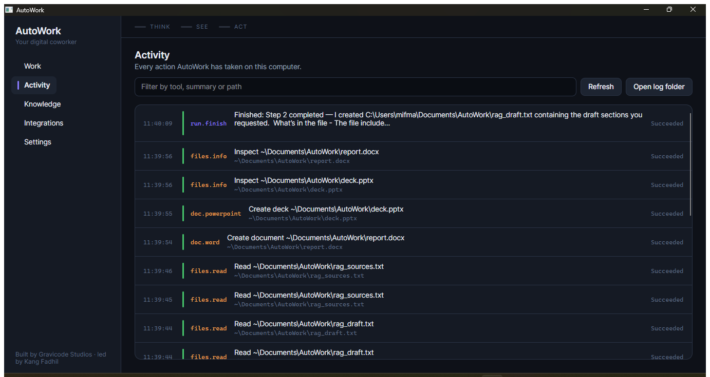

# Architecture

*AutoWork — Gravicode Studios, led by Kang Fadhil*

## The three subsystems

AutoWork is organised as Brain, Eyes and Hands. This is not framing for a README — it is how the
projects are split, how tools are tagged, and how the interface reports what is happening. Every
step and every log line is attributed to one of them, which is what lets the organ rail in the
header answer "what is it doing right now" honestly.

```
                        ┌─────────────────────────────┐
                        │      AutoWork.Desktop       │
                        │   Avalonia UI · Work Tape   │
                        └──────────────┬──────────────┘
                                       │ RunEvent stream
                        ┌──────────────▼──────────────┐
                        │      AutoWork.Agents        │   ← BRAIN
                        │  planner · orchestrator     │
                        │  sub-agents · compaction    │
                        │  verification · vision      │
                        └───┬───────────────────┬─────┘
                            │                   │
          ┌─────────────────▼──────┐   ┌────────▼─────────────────┐
          │   AutoWork.Providers   │   │      AutoWork.Tools      │  ← HANDS + EYES
          │  OpenAI-compatible     │   │  files · shell · docs    │
          │  Anthropic · Ollama    │   │  data · images · screen  │
          │  embeddings            │   │  input · web             │
          └────────────┬───────────┘   └────────┬─────────────────┘
                       │                        │
                       │      ┌─────────────────▼──────────┐
                       │      │  AutoWork.Integrations     │
                       │      │  GitHub · Google · Notion  │
                       │      │  Asana · PayPal            │
                       │      └─────────────────┬──────────┘
                       │                        │
                    ┌──▼────────────────────────▼──┐
                    │        AutoWork.Core         │
                    │  config · secrets · PathGuard │
                    │  action log · knowledge      │
                    └──────────────────────────────┘
```

Core depends on nothing but the framework. Everything depends on Core. The UI depends on all of
it and is depended on by none of it.

## How a run works

```
  goal
   │
   ├─ 1. Build the tool set          policy decides what exists; forbidden tools are
   │                                 never described to the model at all
   │
   ├─ 2. Recall knowledge            search auto-attach knowledge bases for context
   │
   ├─ 3. Plan                        planner model returns JSON: ordered steps, each with
   │                                 an organ, dependencies and success criteria
   │
   ├─ 4. Group into waves            steps whose dependencies are satisfied and that were
   │                                 explicitly marked independent may run together
   │
   ├─ 5. For each wave
   │      ├─ compact if needed       summarise older turns before the step, not after,
   │      │                          so the step has room to work
   │      ├─ run the step            executor model + auto-invoked tools
   │      └─ record the outcome      a step fails only if every tool call in it failed
   │
   ├─ 6. Verify                      check the transcript against the success criteria
   │
   └─ 7. Report                      summary, elapsed, steps, compaction stats
```

Progress is emitted as immutable `RunEvent` records. Core defines them and holds no UI types;
the desktop layer turns them into rows on the Work Tape.

## Why step-shaped rather than one long conversation

A single long chat turn would be simpler. Steps buy three things worth the complexity:

- **A boundary for failure.** One bad step is contained and fed back to the model rather than
  ending the run.
- **Something to watch.** A user can see progress, which is what makes leaving a long job alone
  tolerable.
- **Something concrete to verify.** The verification pass checks declared criteria instead of
  re-deriving intent from a transcript.

## Auto-compaction

When a run approaches the model's context window, older turns are replaced by a summary.

The part that needs care is the **cut point**. Tool calls and their results are paired, and every
provider rejects a conversation where a result has no matching call. So the boundary is walked
backwards until it lands on a clean turn edge before anything is dropped. Leading system messages
and the original goal are always kept — they are the run's charter.

If the summarisation call itself fails, a mechanical summary (tools used, last note) is
substituted rather than losing the run.

`ContextCompactionTests` checks the boundary invariant at **every possible cut point**, because
this is the kind of bug that only appears on long runs, in production, at the worst moment.

## Token estimation

AutoWork talks to a dozen providers, and exact counts need each one's own tokenizer. The
estimator therefore deliberately **over-estimates** — 3.5 characters per token, plus per-message
overhead, plus tool schemas (which ride on every request), plus a flat ~1,200 tokens per image.

Compacting slightly early costs one summarisation call. Compacting late costs the whole run.

## Sub-agents

Independent steps run concurrently, each with its own conversation, so their token use does not
compound and the parent sees only their final reports.

The scheduler is conservative on purpose: only steps the planner **explicitly** marked as
depending on something are considered parallel-safe. A planner that simply forgot to fill in
`dependsOn` must not cause two agents to rename files in the same folder simultaneously.

## Providers

One code path — the OpenAI wire format — covers OpenAI, Azure OpenAI, Gemini, DeepSeek, Qwen,
Moonshot, OpenRouter, LM Studio and any gateway a user points at. Two get their own clients:

- **Anthropic**, because its Messages API differs materially and its OpenAI-compatible shim is
  explicitly a migration aid. The Brain is the part that most needs full tool-use and vision
  fidelity, so `AnthropicChatClient` speaks `/v1/messages` directly.
- **Ollama**, via OllamaSharp.

Clients are cached per profile, keyed on the resolved credential, so rotating a key invalidates
the cache. Function invocation is wrapped with an iteration cap so a model that keeps calling
tools without converging cannot burn a quota inside one step.

## Tools

A tool is an `AIFunction` plus metadata Microsoft.Extensions.AI does not carry: which organ owns
it, how dangerous it is, its category, and what to ask before running it.

Tools return **strings, not exceptions**. A refusal the model can read — `REFUSED: ~/Documents is
read-only` — lets it pick another approach; an exception just ends the turn. `ToolSetBase`
converts the exceptions tools realistically hit into that vocabulary and records every outcome.

Each call is wrapped in an `ObservableAIFunction` so the Work Tape can show it as it happens,
not only after the turn completes.


### Web search

`web_search` runs a chain of backends and stops at the first that answers: **Tavily** if a key is
configured, then **DuckDuckGo**, then **Wikipedia**.

The chain exists so that search is not a paid feature. A user who has signed up for nothing still
gets a working tool rather than one that refuses — the same rule that gives knowledge search a
keyword fallback when there is no embedding model. Tavily leads because it returns extracted page
content and a synthesised answer, which saves the agent fetching and stripping five pages before
it can reason. Wikipedia sits last because it is narrow but almost never unreachable, so the chain
does not end in silence on a network that blocks search engines.

A backend that returns nothing is not an error, it is a reason to ask the next one. The outbound
host allow-list is checked per backend, so a fallback can never reach a host the user has not
permitted.



## Knowledge bases

Plain JSON files, one per base, vectors inline, searched by cosine similarity over an in-memory
list.

A desktop knowledge base holds thousands of entries, not millions. A linear SIMD scan beats
carrying a vector database as a dependency, and it keeps the user's memory in a file they can
read, back up and delete. With no embedding model configured, search degrades to token overlap
rather than failing.


## The interface

**Design system.** The palette is derived from the product's own anatomy: Brain, Eyes and Hands
each own a hue, and every step, tool row and log line is tinted by whichever is responsible.
Colour carries information rather than decoration. Everything else is a disciplined neutral.

Organ tinting is applied through **styling classes bound to the row's organ**, not a value
converter, so switching theme repaints live instead of leaving stale brushes behind.

**The Work Tape** is the signature element: a continuous hairline spine with numbered stamps and
nested tool rows. Numbering is justified here because agent steps genuinely are a sequence and
the order carries information the reader needs.

**The organ rail** in the header is three segments that light in their own hue as each faculty
takes over — the honest answer to whether AutoWork is currently thinking, looking at your screen,
or touching your files.

**Composition** is hand-wired in `AppServices` rather than through a DI container. The graph is a
dozen objects that never change shape, and a container's reflection cost lands directly on
time-to-window.

## Project reference

| Project | Depends on | Holds |
|---|---|---|
| `AutoWork.Core` | — | Config, presets, secrets, `PathGuard`, approvals, action log, knowledge, agent contracts |
| `AutoWork.Providers` | Core | Chat client factory, Anthropic client, embeddings, connection testing |
| `AutoWork.Tools` | Core | Files, shell, documents, data, images, screen capture, input, web |
| `AutoWork.Agents` | Core, Providers, Tools | Planner, orchestrator, sub-agents, compaction, vision, knowledge tools, tool registry |
| `AutoWork.Integrations` | Core | Connector framework and connectors |
| `AutoWork.Desktop` | all | Avalonia UI, view models, theme, localisation |
