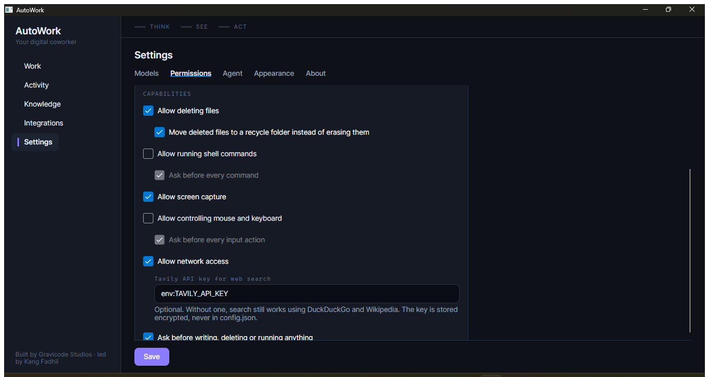
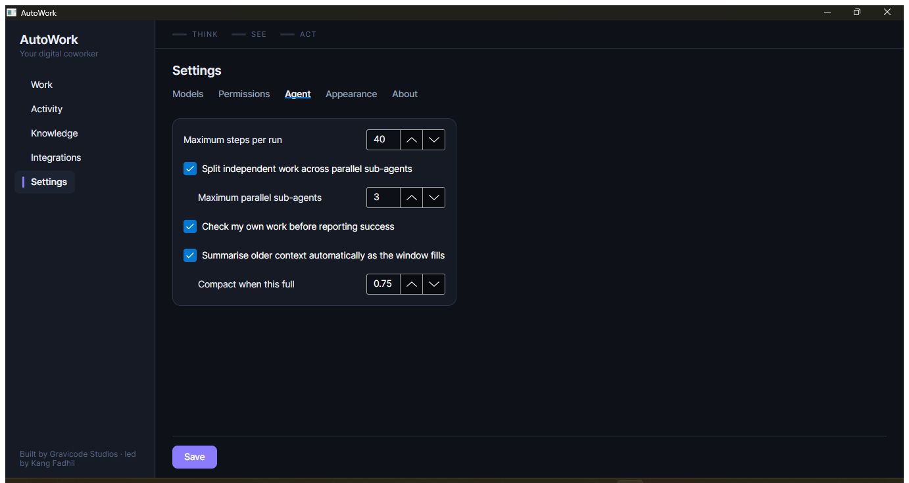

# Configuration

*AutoWork — Gravicode Studios, led by Kang Fadhil*

Three layers, lowest precedence first:

1. **`config.json`** — what the app saves
2. **Environment variables** — applied on top at launch, never written back
3. **The app's UI** — what you change in Settings, which is saved to `config.json`

The middle layer never persists. Exporting `AUTOWORK_ALLOW_SHELL=false` for one launch does not
silently rewrite the policy you saved.

## Models

AutoWork talks to any provider you configure. Nearly all of them speak the OpenAI wire format,
so one code path covers most; Anthropic and Ollama have their own clients because their
protocols genuinely differ.


### Built-in presets

| Preset | Endpoint | Environment variable |
|---|---|---|
| `openai` | `https://api.openai.com/v1` | `OPENAI_API_KEY` |
| `azure-openai` | your resource URL — see below | `AZURE_OPENAI_API_KEY` |
| `anthropic` | `https://api.anthropic.com/v1` | `ANTHROPIC_API_KEY` |
| `gemini` | `https://generativelanguage.googleapis.com/v1beta/openai/` | `GEMINI_API_KEY` |
| `ollama` | `http://localhost:11434` | `OLLAMA_HOST` |
| `deepseek` | `https://api.deepseek.com/v1` | `DEEPSEEK_API_KEY` |
| `qwen` | `https://dashscope-intl.aliyuncs.com/compatible-mode/v1` | `DASHSCOPE_API_KEY` |
| `moonshot` | `https://api.moonshot.ai/v1` | `MOONSHOT_API_KEY` |
| `openrouter` | `https://openrouter.ai/api/v1` | `OPENROUTER_API_KEY` |
| `lmstudio` | `http://localhost:1234/v1` | — |
| `custom` | you supply it | — |

> **Model ids move faster than this app ships.** The default model id in each preset is a
> starting point, not a supported-model list. Check the id against your provider's current
> catalogue and edit it in Settings. Anything with an OpenAI-compatible endpoint works through
> `custom` even if it is not listed here.

### Azure OpenAI

Azure gives every resource its own hostname and lets you name your own deployments, so it is the
one preset where nothing can be filled in for you.

Paste the endpoint exactly as the Azure portal shows it:

```
https://your-resource.openai.azure.com/
```

AutoWork completes it to `/openai/v1`, Azure's OpenAI-compatible surface. If you prefer, you can
type the full path yourself — including the older `/openai/deployments/…` form — and it is left
as you typed it.

The **model id is your deployment name**, not the underlying model name. They often match, but
they do not have to.

Reasoning deployments — the gpt-5 family, the o-series — reject a custom `temperature` and reject
`max_tokens`, and they spend their output budget thinking before they write anything. AutoWork
detects all three from the provider's own reply and adapts, so no setting is needed. After a
connection test, Settings tells you which of your settings the model would not accept.

### Model roles

Four jobs, each assignable to a different model:

| Role | Used for | Needs |
|---|---|---|
| Planning and reasoning | Building the plan, summarising, verifying | Tool support |
| Doing the work | Executing steps and calling tools | Tool support |
| Reading the screen | `screen_look`, `image_describe` | Vision |
| Knowledge search | Embedding knowledge entries and queries | Embeddings |

Leaving a role unset picks the first enabled model with the right capability. A common setup is
a strong model for planning and a cheap fast one for execution.

### API keys

Keys are **never** written to `config.json`. The file stores a reference:

- a name in the encrypted secret store, or
- `env:VARIABLE_NAME`, read from the environment at call time and never persisted at all

That means `config.json` is safe to copy between machines or commit to a private repo.

To use an external secret manager, type `env:MY_VAR` into the API key box and inject `MY_VAR`
however you like.

## Environment variables

### Provider keys

Export any vendor key and AutoWork creates a matching model on first launch:

```bash
export ANTHROPIC_API_KEY=sk-ant-...
export OPENAI_API_KEY=sk-...
export OLLAMA_HOST=http://localhost:11434
```

A model you have already configured for that provider is never overwritten.

Azure needs three, because a key alone does not say where to send it or what to ask for:

```bash
export AZURE_OPENAI_API_KEY=...
export AZURE_OPENAI_ENDPOINT=https://your-resource.openai.azure.com/
export AZURE_OPENAI_DEPLOYMENT=gpt-5-mini
```

With the endpoint missing, no Azure model is created at all — an uncallable model would be
picked as the default planner and fail every run.

### Web search

```bash
export TAVILY_API_KEY=tvly-...
```

Optional. Search works without it, falling back to DuckDuckGo and then Wikipedia; a key buys
better results and a synthesised answer. Set it here, or in Settings › Permissions, where it is
stored encrypted like any model key.



### Defining one model outright

For containers and CI:

```bash
export AUTOWORK_MODEL=llama3.3:70b
export AUTOWORK_ENDPOINT=http://gpu-box.internal:11434/v1
export AUTOWORK_PROVIDER=custom          # a preset id, or "custom"
export AUTOWORK_API_KEY=...              # optional
export AUTOWORK_CONTEXT_WINDOW=131072    # optional
```

This model is created and selected as the planner, overriding whatever was saved.

### Permissions

```bash
export AUTOWORK_FOLDERS="$HOME/Documents;$HOME/Downloads"   # read/write grants
export AUTOWORK_FOLDERS_READONLY="$HOME/Reference"          # read-only grants
export AUTOWORK_ALLOW_SHELL=false
export AUTOWORK_ALLOW_DELETE=true
export AUTOWORK_ALLOW_INPUT=false
export AUTOWORK_ALLOW_SCREEN=true
```

Separate multiple folders with `;` or `,`.

### Agent behaviour

The same settings live in **Settings › Agent**:



```bash
export AUTOWORK_MAX_STEPS=40
export AUTOWORK_AUTO_COMPACT=true
export AUTOWORK_COMPACT_THRESHOLD=0.75   # compact at 75% of the context window
```

### Appearance and location

```bash
export AUTOWORK_THEME=Dark        # System | Light | Dark
export AUTOWORK_LANGUAGE=Indonesian   # System | English | Indonesian
export AUTOWORK_HOME=/media/usb/autowork   # move the whole data folder
```

## config.json

Annotated excerpt:

```jsonc
{
  "schemaVersion": 1,
  "models": [
    {
      "id": "a1b2c3d4",
      "displayName": "Anthropic — claude-sonnet-5",
      "preset": "anthropic",
      "kind": "Anthropic",
      "endpoint": "https://api.anthropic.com/v1",
      "modelId": "claude-sonnet-5",
      "apiKeyRef": "env:ANTHROPIC_API_KEY",   // reference, never the key
      "contextWindow": 200000,
      "maxOutputTokens": 8192,
      "temperature": 0.2,
      "capabilities": "Tools, Vision, Reasoning",
      "enabled": true
    }
  ],
  "agent": {
    "plannerModelId": "a1b2c3d4",
    "maxSteps": 40,
    "maxConsecutiveFailures": 3,
    "maxParallelSubAgents": 3,
    "enableSubAgents": true,
    "enableSelfVerification": true,
    "enableAutoCompact": true,
    "autoCompactThreshold": 0.75,
    "compactKeepRecentTurns": 6,
    "toolTimeoutSeconds": 120
  },
  "permissions": {
    "roots": [
      { "path": "/home/fadhil/Documents", "access": "ReadWrite", "includeSubfolders": true }
    ],
    "deniedPatterns": ["**/.ssh/**", "**/*.pem", "**/.env"],
    "allowDelete": true,
    "softDelete": true,
    "allowShell": false,
    "allowNetwork": true,
    "allowScreenCapture": true,
    "allowInputControl": false,
    "maxReadBytes": 33554432,
    "maxBatchSize": 500
  },
  "appearance": { "theme": "System", "language": "System", "reduceMotion": false }
}
```

Editing this file by hand is fine — AutoWork reads it at launch. A corrupt file is moved aside
as `config.json.broken-<timestamp>` and defaults are used rather than blocking startup.

## Agent tuning

| Setting | What it does | When to change it |
|---|---|---|
| `maxSteps` | Hard ceiling on steps per run | Raise for very long jobs; lower to bound cost |
| `maxConsecutiveFailures` | Failures in a row before giving up | Lower if you would rather it stopped early |
| `enableSubAgents` | Run independent steps in parallel | Turn off if a provider rate-limits you |
| `enableSelfVerification` | Check the work before reporting success | Costs one extra call; worth it |
| `autoCompactThreshold` | Fraction of the window that triggers compaction | Lower for models that degrade when nearly full |
| `compactKeepRecentTurns` | Turns kept verbatim when compacting | Raise if it loses its footing after a compaction |
| `toolTimeoutSeconds` | Per-tool-call wall clock limit | Raise for slow shell commands |
