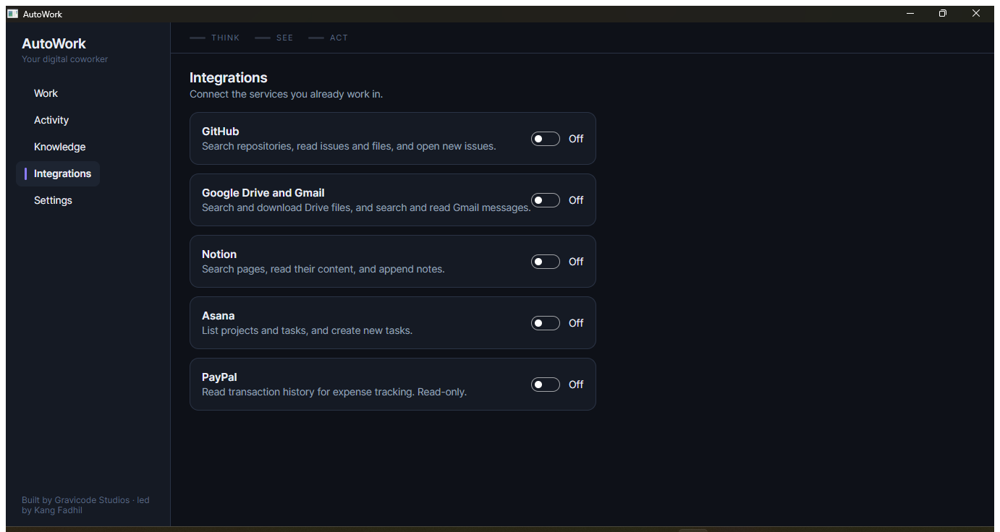

# Integrations

*AutoWork — Gravicode Studios, led by Kang Fadhil*

Connect the services you already work in. Each connector adds tools the agent can call.

Enable one in **Settings › Integrations**, fill in its credentials, and press **Test connection**
before relying on it. A connector that is disabled or missing credentials contributes no tools at
all — rather than contributing tools that fail on every call.

Credentials follow the same rule as model API keys: secrets go to the encrypted store or an
`env:VARIABLE`, never into `config.json`.

> Network access must be on (**Settings › Permissions**) or no connector loads.



---

## GitHub

**Credentials.** A personal access token from
[github.com/settings/tokens](https://github.com/settings/tokens). A fine-grained token is
preferable; it needs repository read access, plus issue write if you want `github_create_issue`.

**Optional.** A default repository in `owner/name` form, used when a tool is called without one.

**Tools**

| Tool | Does |
|---|---|
| `github_search_repos` | Search repositories |
| `github_list_issues` | List issues in a repository |
| `github_read_file` | Read a file at a branch, tag or commit |
| `github_create_issue` | Open a new issue |

---

## Google Drive and Gmail

Both live in one connector because they share an OAuth client and refresh token.

**Why you supply your own OAuth client.** AutoWork is a desktop app and cannot keep a client
secret secret, so it does not pretend to. You create an OAuth client in your own Google Cloud
project and complete consent once. The credential is then scoped to your project rather than a
shared one — the right trade for a tool that can read your mail.

**Setup**

1. In [Google Cloud Console](https://console.cloud.google.com/apis/credentials), create a project.
2. Enable the **Google Drive API** and the **Gmail API**.
3. Configure the OAuth consent screen. While it is in Testing, add yourself as a test user.
4. Create credentials → **OAuth client ID** → **Desktop app**. Note the client id and secret.
5. Obtain a refresh token once, with these scopes:
   ```
   https://www.googleapis.com/auth/drive.readonly
   https://www.googleapis.com/auth/gmail.readonly
   ```
   The [OAuth 2.0 Playground](https://developers.google.com/oauthplayground) is the quickest
   route: open its settings, tick *Use your own OAuth credentials*, paste your client id and
   secret, authorise those two scopes, then exchange the code for tokens and copy the **refresh
   token**.
6. Paste the client id, client secret and refresh token into AutoWork.

Access tokens are exchanged on demand and held in memory only, never written to disk.

**Tools**

| Tool | Does |
|---|---|
| `drive_search` | Search Drive by name and full text |
| `drive_download` | Download a file into a granted folder. Google-native formats are exported to Office equivalents. |
| `gmail_search` | Search messages with Gmail query syntax (`from:`, `has:attachment`, `newer_than:30d`) |
| `gmail_read` | Read a message's full text |

`drive_download` writes to your disk, so it passes through the sandbox exactly like any other
file operation — the destination must be inside a granted read/write folder.

The scopes above are read-only. AutoWork does not request write access to Drive or Gmail.

---

## Notion

**Credentials.** An internal integration token from
[notion.so/my-integrations](https://www.notion.so/my-integrations).

**Important.** Notion's permission model is share-based. Your token sees *nothing* until you
share pages with the integration: open a page → **Connections** → add AutoWork. The connection
test says so explicitly when it connects but finds no pages, because this trips up most people.

**Tools**

| Tool | Does |
|---|---|
| `notion_search` | Search shared pages and databases |
| `notion_read_page` | Read a page's text content |
| `notion_append` | Append a paragraph to a page |

---

## Asana

**Credentials.** A personal access token from **My Settings › Apps › Manage developer apps**.

**Optional.** A default workspace id, visible in the URL when viewing your workspace.

**Tools**

| Tool | Does |
|---|---|
| `asana_list_projects` | List projects |
| `asana_list_tasks` | List tasks in a project |
| `asana_create_task` | Create a task, optionally with notes and a due date |

---

## PayPal

For the expense-tracking use case.

**Credentials.** Client id and secret from a REST app in the
[developer dashboard](https://developer.paypal.com/dashboard/applications). Set the environment
to `live` or `sandbox`.

**Read-only by design.** No payment, refund or payout tool is exposed, regardless of what the
credentials would technically permit. An LLM in the loop has no business being able to move
money.

**Tools**

| Tool | Does |
|---|---|
| `paypal_list_transactions` | Transactions in a date range (PayPal caps this at 31 days per query) |
| `paypal_balances` | Current balances |

---

## Troubleshooting

**"The credentials were rejected."** The token is wrong, expired or revoked. Re-issue it.

**"Access denied — the token is valid but lacks the required scope."** The token authenticates
but is missing a permission. For GitHub, check repository access; for Google, check the scopes
you authorised.

**Notion connects but finds nothing.** Pages have not been shared with the integration. See above.

**Google stops working after a while.** A refresh token for an app still in *Testing* expires
after seven days. Publish the consent screen, or re-issue the token.

**No connector tools appear.** Check that network access is enabled in Settings › Permissions,
that the integration is toggled on, and that its required fields are filled in.

## Adding your own connector

Implement `IIntegration` (or derive from `RestConnector` for the HTTP plumbing), then register it
in `IntegrationRegistry`. A connector declares its fields, tests its own connection, and yields
`ToolDescriptor`s. See `GitHubIntegration` for the smallest complete example.

Registration is static rather than plugin-based on purpose: loading third-party assemblies into
the process that holds the user's API keys is not a trade worth making. See [PLAN.md](../../PLAN.md).
