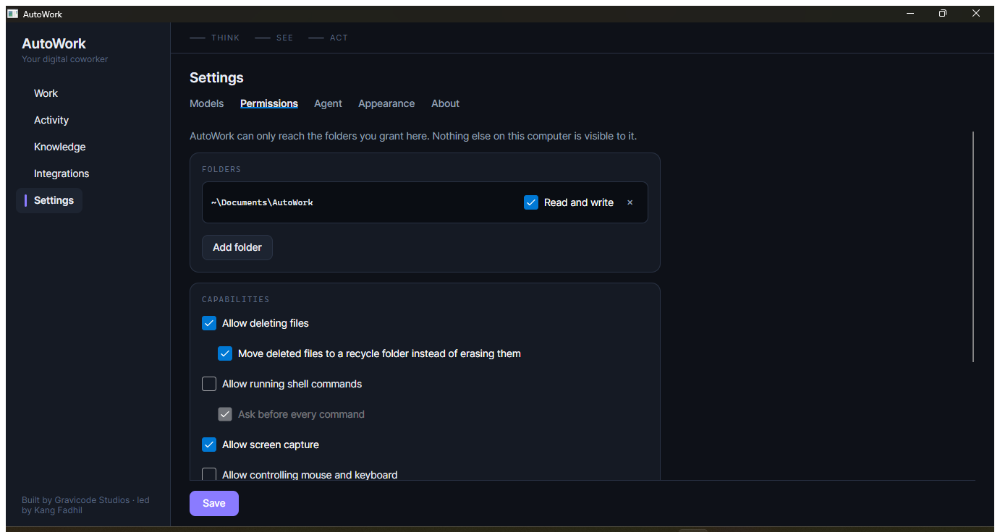

# Security model

*AutoWork — Gravicode Studios, led by Kang Fadhil*

AutoWork runs an AI agent with access to your filesystem. That is useful precisely because it is
powerful, which means the boundaries need to be explicit, testable, and honestly described.

This document states what is guaranteed, what is merely gated, and what is not protected at all.

---

## The claim

**AutoWork can only reach the folders you grant it.**

Everything below is in service of making that claim true and verifiable.

## Deny by default

A fresh install has no folder grants beyond one: `Documents\AutoWork`. Every file operation
outside it is refused until you add a folder in **Settings › Permissions**.

This is deliberately inconvenient. An assistant that could read your whole home directory the
moment you installed it would be a worse trade than one that makes you think for ten seconds.



## One chokepoint: `PathGuard`

Every filesystem tool routes through `PathGuard` before touching anything. The checks run in
order, and all must pass:

**1. Canonicalise, resolving symlinks.**
The path is expanded, made absolute, and then walked component by component with every symbolic
link resolved to its final target. Without this step, a link inside a granted folder pointing at
`~/.ssh` would be a free pass to anywhere on disk. Broken or circular links are refused.

**2. Reject protected locations.**
OS internals (`C:\Windows`, `/etc`, `/usr/bin`, `/System`, …) and AutoWork's own data folder are
never reachable, even if you explicitly grant them. AutoWork's folder holds the secret store, so
this closes the obvious loop where the agent reads its own keys.

**3. Require containment in a granted root.**
The canonical path must sit inside a folder you granted, compared with a **segment boundary** —
so a grant on `~/Documents` does not accidentally cover `~/Documents-backup`. The most specific
matching grant wins, which lets a read-only sub-folder narrow a read/write parent.

**4. Apply denied patterns.**
Glob patterns refused even inside a granted folder. Defaults:

```
**/.ssh/**    **/.aws/**    **/.gnupg/**    **/.git/config
**/*.pem      **/*.key      **/*.pfx        **/id_rsa*
**/.env       **/.env.*     **/secrets.json
**/AppData/Local/Microsoft/Credentials/**   **/Library/Keychains/**
```

Add your own in Settings.

### Tested, not asserted

`SandboxTests` is written as a series of attempted escapes:

- relative traversal (`granted/../private/secrets.txt`)
- absolute paths outside every root
- a sibling folder sharing a name prefix with a granted one
- a **symlink inside a granted folder pointing outside it**
- writing to a read-only grant
- reading a denied pattern inside a granted folder
- reaching AutoWork's own data folder after explicitly granting it
- operating with no grants at all

All are expected to fail with a specific reason code. If you change `PathGuard`, these are the
tests that tell you whether you broke the product's central promise.

## Capabilities are opt-in

| Capability | Default | Notes |
|---|---|---|
| Read granted folders | On, once granted | — |
| Write granted folders | Per-grant | Each folder is read-only or read/write |
| Delete | **Off** | Separate switch from writing |
| Soft delete | On | Deleted files move to a recycle folder inside AutoWork's protected directory, so the agent cannot read them back |
| Shell commands | **Off** | Optional executable allow-list; approval-gated |
| MCP servers | **Off** | Starts external programs with your rights. See below |
| Screen capture | On | Approval-gated |
| Mouse and keyboard control | **Off** | Approval-gated |
| Network | On | Optional host allow-list |

A capability that is off is not merely refused — the tools that use it are **never described to
the model at all**. It cannot try what it does not know exists.

## Consent

Actions that write, delete, run commands or drive input raise an approval request. It appears
**inline in the Work Tape**, not as a modal dialog, showing the actual command line or file list
rather than a summary.

Modal dialogs train people to click through them. Keeping the request attached to its context is
the only way consent means anything.

"Allow for this run" exists for repeatable, reversible kinds — writes, network, screen capture —
so a 200-file batch asks once. It is deliberately **not offered for deletes or shell commands**:
a standing grant is the wrong affordance for an irreversible act.

## MCP servers are outside the sandbox

An MCP server is a program AutoWork starts — usually `npx something` — and it runs with your full
user rights. `PathGuard` governs *AutoWork's* file tools; it cannot reach inside another process.
A filesystem MCP server can read whatever the operating system lets it read, whatever you granted
in Settings.

This is the same class of power as the shell tool, so it gets the same treatment:

- **A capability switch.** `Settings › Permissions › Allow MCP servers`, off by default. With it
  off, no server is started and no MCP tool is described to the model, even if servers are
  configured.
- **A per-server switch.** Adding a server from the gallery writes a command line into
  `config.json`. It does not start anything. Enabling is a second, deliberate act.
- **The command line is always shown**, so what will actually be launched is never a mystery.
- **Their tools are marked as writing**, not as safe — AutoWork cannot see what an external tool
  does, and claiming otherwise would be a guarantee it cannot make.

Keys an MCP server needs go to the encrypted secret store like any other, and `config.json` keeps
only the reference.

The built-in catalogue lists servers whose packages were checked against their registry and are
not deprecated. It is a starting point, not an endorsement: you are running someone else's code.

## Skills are instructions, not code

An installed skill is Markdown the model reads. It cannot grant a capability, call a tool the
permission policy forbids, or execute anything by itself — the worst a bad skill can do is give
the model bad advice, bounded by the same sandbox as everything else.

Skills are installed into AutoWork's own data directory, which `PathGuard` protects. The agent
therefore cannot rewrite its own instructions with the file tools; installing and removing stay
deliberate acts in the Skills gallery.

The repository each skill came from is shown next to it, because whose instructions you are
following is the part worth knowing.

## The action log

Every action lands in an append-only JSON Lines file at `logs/actions.jsonl`, with:

```
timestamp · run id · subsystem · tool · one-line summary · outcome · paths · duration · error
```

It is append-only so a crash mid-write cannot corrupt earlier entries, and it rotates at 8 MB.
The Activity view streams it live while a run is in progress.

Outcomes include `Denied`, so refused attempts are recorded too. If the agent tried something it
was not allowed to do, you will see it.

## Secrets

API keys are stored separately from configuration and encrypted with **AES-GCM**. The encryption
key is held in a sibling file.

- **Windows** — the AES key is wrapped with **DPAPI** (current-user scope). The store cannot be
  read by another account or moved to another machine.
- **Linux and macOS** — there is no DPAPI equivalent used here. The key file is created with
  owner-only permissions (`0600`) before any bytes are written. Protection is therefore
  equivalent to an SSH private key: anyone who can read your home directory as you can read your
  keys.

That is a real difference and worth stating plainly rather than dressing up. If you need a
stronger guarantee, reference keys as `env:VARIABLE_NAME` and let a proper secret manager inject
them — AutoWork then never persists them at all.

`config.json` contains only references. It is safe to copy or version.

## What is *not* protected

Being straightforward about this is more useful than a longer list of features.

**Synthetic input cannot be sandboxed.** Once a keystroke or click is synthesised it goes to
whichever window has focus. No permission model inside this process can constrain that. The
capability is off by default and approval-gated; those are consent controls, not containment.

**Shell commands run as you.** The working directory is pinned inside a granted folder, and an
optional allow-list restricts which executables may run — but the command itself has your full
user privileges. If you enable shell access, you are trusting the model's judgement about
commands. Keep it off unless you need it, and use the allow-list when you do.

**Network egress is coarse.** The host allow-list applies to AutoWork's own web tools. A shell
command can reach the network regardless.

**Prompt injection is a live risk.** A file or web page the agent reads can contain text trying
to redirect it. The sandbox is the mitigation — instructions cannot grant new permissions, and
anything outside your granted folders stays out of reach whatever the model is persuaded to
attempt. Approval gates on destructive actions are the second line. Neither makes injection
impossible; both bound the damage.

**The model provider sees what you send.** File contents, screenshots and extracted data go to
whichever provider you configured. For work that must not leave the machine, use Ollama or
LM Studio and AutoWork operates entirely offline.

## Recommended setup

**Cautious** — the default. Grant one project folder as read/write. Leave delete, shell and
input control off.

**Everyday** — grant your working folders. Enable delete with soft delete on. Leave shell and
input off.

**Power user** — enable shell with an executable allow-list (`git`, `python`, `ffmpeg`). Keep
"ask before every command" on. Enable input control only for the session you need it.

**Air-gapped** — Ollama as the provider, network off, no integrations. Nothing leaves the
machine.

## Reporting a vulnerability

Please report security issues privately to Gravicode Studios rather than opening a public issue.
