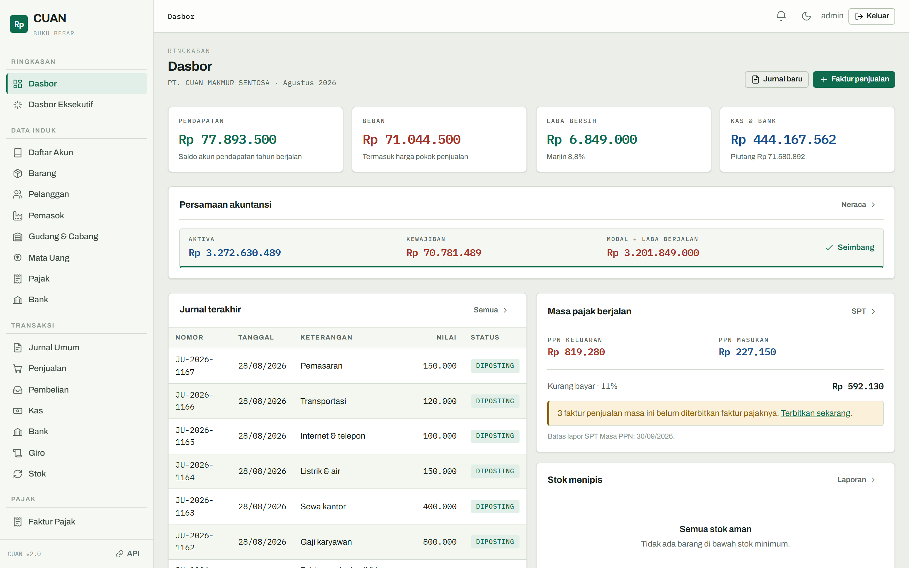
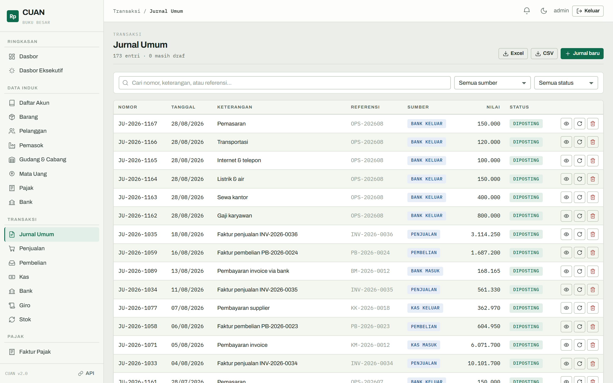
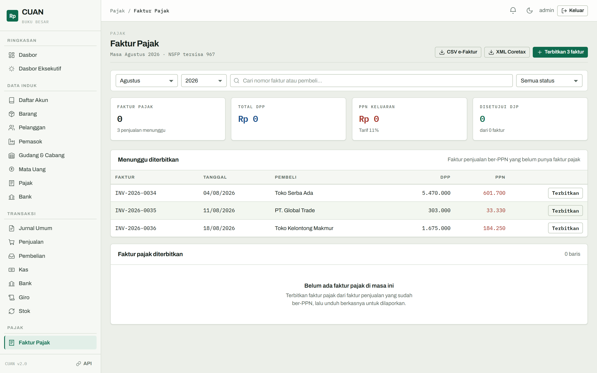
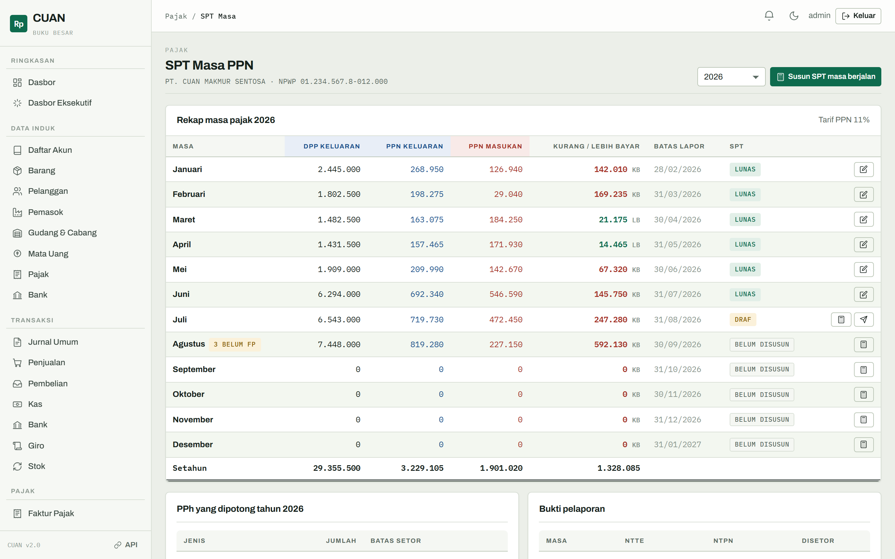
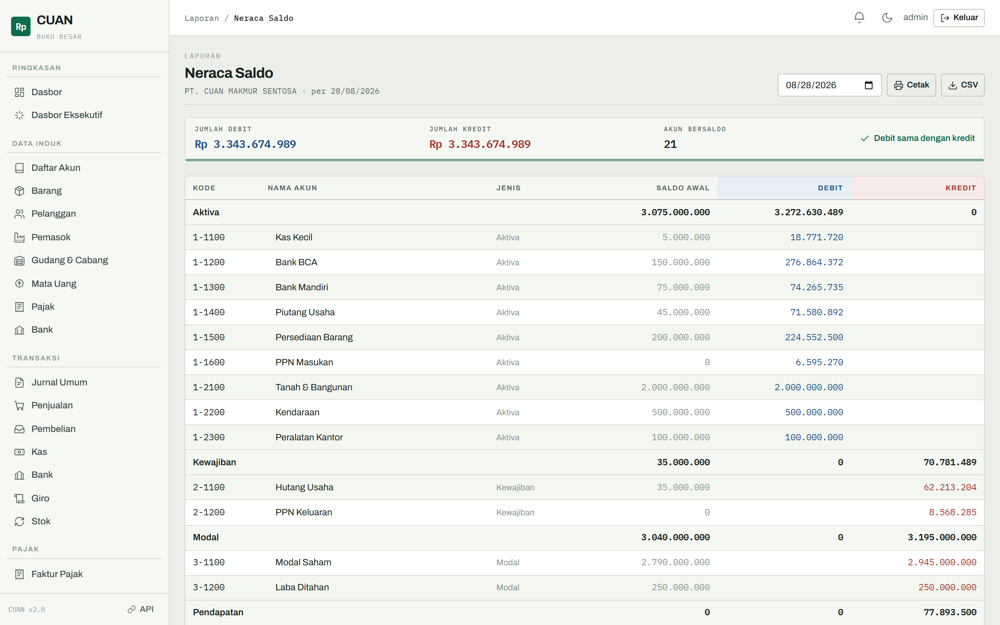
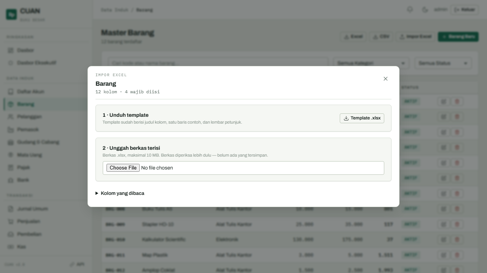
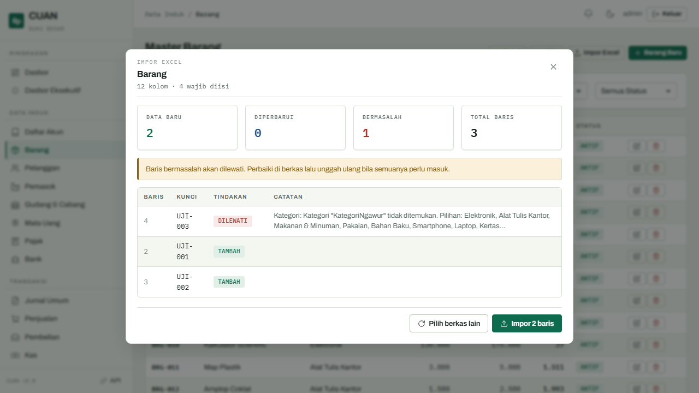
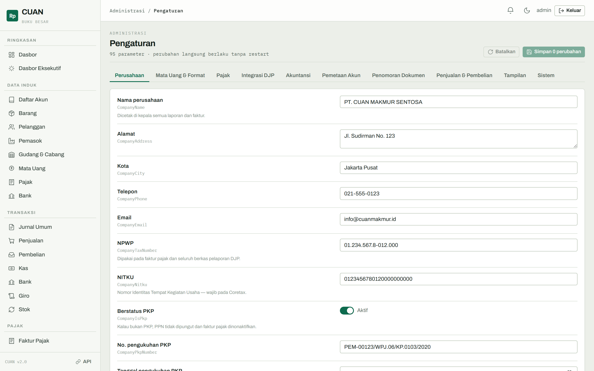
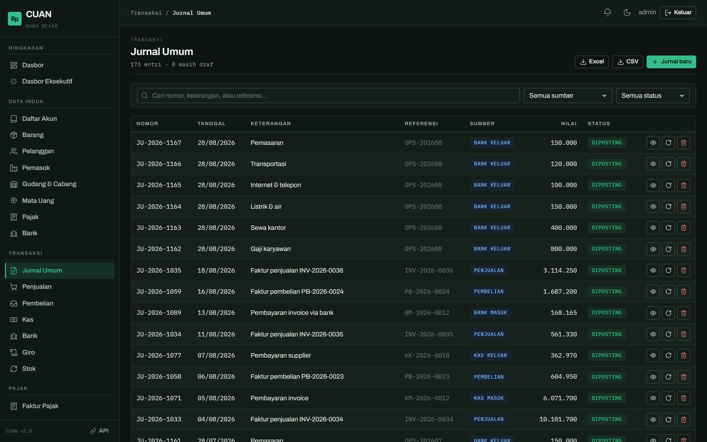

# CUAN — Sistem Akuntansi Berbasis Web

Pembukuan berpasangan untuk usaha di Indonesia. Jurnal, faktur, kas, bank, giro,
stok, sampai faktur pajak dan SPT Masa PPN — dalam satu buku yang selalu seimbang.

Dibangun dengan **Blazor Server (.NET 10)**, antarmuka Bahasa Indonesia, mata uang
dasar Rupiah.



---

## Menjalankan

```bash
dotnet restore
dotnet build
dotnet run                        # http://localhost:5081
dotnet run --launch-profile https # https://localhost:7223
```

Buka `http://localhost:5081`, masuk dengan `admin@cuan.id` / `Cuan@123`.

Basis data SQLite (`Cuan.db`) dibuat otomatis pada boot pertama beserta data
contoh: 12 bulan transaksi bergulir yang berakhir di bulan berjalan, jadi
dasbor dan laporan pajak tidak pernah kosong tahun berapa pun aplikasi ini
dijalankan.

Dokumentasi API tersedia di `/swagger` (hanya di lingkungan Development).

---

## Yang membedakan

**Buku yang benar-benar seimbang.** Setiap faktur, penerimaan kas, mutasi bank,
giro, dan penyesuaian stok membentuk jurnal berpasangan, dan setiap jurnal yang
diposting menggerakkan saldo akun. Neraca Saldo memverifikasi debit sama dengan
kredit; Neraca memverifikasi aktiva sama dengan kewajiban ditambah modal. Kalau
timpang, angkanya terlihat langsung — tidak disembunyikan.

**Tidak ada angka yang ditanam di dalam kode.** Tarif PPN, tarif PPh, pemetaan
akun, awalan nomor dokumen, termin pembayaran, format mata uang, sampai kredensial
DJP — semuanya parameter yang bisa diubah dari halaman Pengaturan dan langsung
berlaku tanpa restart.

**Perpajakan Indonesia sebagai warga kelas satu.** Faktur pajak dengan penomoran
NSFP, bukti potong PPh 21/23/4(2), SPT Masa PPN beserta pembetulannya, ekspor
e-Faktur (CSV) dan Coretax (XML), serta jalur host-to-host ke DJP yang tinggal
diisi kredensialnya.

---

## Tur singkat

### Jurnal umum

Debit di kiri, kredit di kanan, masing-masing dengan warna tintanya sendiri.
Bilah keseimbangan di bawah formulir berubah dari garis putus-putus merah menjadi
garis ganda hijau begitu debit sama dengan kredit — dan tombol simpan baru
terbuka setelah itu.



### Faktur pajak

Faktur penjualan ber-PPN yang belum diterbitkan faktur pajaknya ditampilkan di
panel atas, lengkap dengan tombol terbitkan massal. Nomor seri diambil dari jatah
NSFP, dan sisa jatah diingatkan sebelum habis.



### SPT Masa PPN

Dua belas masa pajak dalam satu tabel: DPP dan PPN keluaran di kolom debit, PPN
masukan di kolom kredit, posisi kurang/lebih bayar, batas lapor, dan status SPT.
Masa yang lewat tenggat dan belum dilaporkan ditandai merah.



### Neraca saldo



### Impor Excel

Setiap halaman data induk punya tombol **Impor Excel**. Templatnya dibuat dari
definisi kolom yang sama dengan yang membaca berkasnya, jadi keduanya selalu
cocok. Berkas diperiksa lebih dulu: baris yang lolos dipisahkan dari yang
bermasalah, lengkap dengan alasan per baris, dan tidak ada yang tersimpan
sebelum tombol impor ditekan. Baris dengan kunci yang sudah ada memperbarui data
lama alih-alih menambah duplikat.



Setelah berkas diunggah, tampilan berganti menjadi pratinjau:



### Pengaturan

95 parameter dalam sepuluh kelompok. Setiap parameter menyebut kunci teknisnya,
menjelaskan akibat perubahannya, dan menandai dirinya "diubah" sebelum disimpan.



### Tema gelap

Seluruh halaman punya padanan gelap; pilihan tema tersimpan di perangkat
masing-masing pengguna.



**[Lihat seluruh tangkapan layar →](docs/README.md)**

---

## Fitur

| Modul | Isi |
|-------|-----|
| **Data induk** | Chart of Accounts bertingkat, barang multi-satuan, pelanggan & pemasok, gudang & cabang, mata uang & kurs, jenis pajak, rekening bank |
| **Transaksi** | Jurnal umum, faktur penjualan, faktur pembelian, kas masuk/keluar, bank masuk/keluar, giro, penyesuaian stok |
| **Pajak** | Faktur pajak + NSFP, bukti potong PPh 21/23/4(2), SPT Masa PPN + pembetulan, ekspor e-Faktur & Coretax, integrasi DJP |
| **Laporan** | Buku besar, neraca saldo, laba rugi, neraca, arus kas (metode langsung), penjualan, stok, pajak, dasbor eksekutif |
| **Impor** | Setiap data induk bisa diisi massal dari Excel: unduh template, isi, unggah, periksa pratinjau, impor |
| **Administrasi** | Pengguna & 7 peran, pengaturan 95 parameter, jejak audit otomatis, kunci API |
| **Integrasi** | REST API 24 endpoint dengan kunci API, Swagger, notifikasi real-time SignalR, ekspor CSV/Excel/PDF |

---

## Peran

Tujuh peran, dan menu di sisi kiri hanya menampilkan halaman yang boleh dibuka
peran yang sedang masuk.

| Akun | Peran | Akses |
|------|-------|-------|
| admin@cuan.id | Admin | Seluruh fitur |
| akuntan@cuan.id | Akuntan | Jurnal, laporan, pajak |
| kasir@cuan.id | Kasir | Kas, bank, giro |
| gudang@cuan.id | StafGudang | Barang dan stok |
| sales@cuan.id | Sales | Penjualan dan pelanggan |
| purchasing@cuan.id | Purchasing | Pembelian dan pemasok |
| viewer@cuan.id | Viewer | Laporan saja |

Kata sandi seluruh akun contoh: `Cuan@123`.
Matikan panel akun contoh di halaman masuk lewat **Pengaturan → Tampilan →
Tampilkan akun contoh di halaman masuk** sebelum dipakai sungguhan.

---

## REST API

Autentikasi memakai header `X-Api-Key`. Kunci bawaan: `cu4n-4p1-k3y-2024-d3f4ult`
(kelola di `/admin/apikeys`).

```bash
curl -H "X-Api-Key: cu4n-4p1-k3y-2024-d3f4ult" \
     http://localhost:5081/api/v1/items
```

| Endpoint | Keterangan |
|----------|------------|
| `GET /api/v1/coa` · `GET /api/v1/coa/{id}` · `POST /api/v1/coa` | Chart of Accounts |
| `GET /api/v1/items` · `/items/{id}` · `/items/low-stock` · `/items/{id}/stock` | Barang dan stok |
| `GET /api/v1/customers` · `/customers/{id}` · `/suppliers` | Mitra usaha |
| `GET /api/v1/journals` · `/journals/{id}` · `POST /api/v1/journals` | Jurnal umum |
| `GET /api/v1/sales-invoices` · `/purchase-invoices` | Faktur |
| `GET /api/v1/cash-transactions` · `/bank-transactions` · `/stock-movements` | Mutasi |
| `GET /api/v1/dashboard/summary` | Ringkasan dasbor |
| `GET /api/v1/export/coa/csv` · `/export/items/csv` | Ekspor CSV |

Daftar lengkap beserta parameternya ada di `/swagger`.

---

## Konfigurasi

Dua lapis, dengan pembagian tugas yang jelas:

- **`appsettings.json`** — hal yang dibutuhkan sebelum basis data bisa dibuka:
  penyedia basis data, connection string, kunci API bawaan.
- **Halaman `/admin/settings`** — segala sesuatu yang berubah saat aplikasi
  berjalan. Nilainya tersimpan di tabel `SystemSettings`, dibaca lewat cache,
  dan berlaku seketika begitu disimpan.

Berpindah dari SQLite ke SQL Server atau MySQL cukup lewat `Database:Provider`;
paket dan konfigurasinya sudah tersedia.

---

## Dokumentasi lain

- **[docs/README.md](docs/README.md)** — galeri tangkapan layar seluruh halaman
- **[docs/PAJAK.md](docs/PAJAK.md)** — alur perpajakan dan integrasi DJP
- **[CLAUDE.md](CLAUDE.md)** — catatan arsitektur untuk pengembang

---

## Tumpukan teknologi

.NET 10 · Blazor Server · Entity Framework Core (SQLite / SQL Server / MySQL) ·
ASP.NET Identity · SignalR · Swashbuckle · ClosedXML · CsvHelper · QuestPDF ·
Blazor-ApexCharts

---

## Dibuat oleh

**Gravicode Studios** — dipimpin oleh kang Fadhil
<https://studios.gravicode.com>
