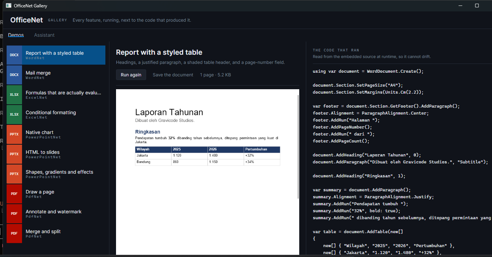
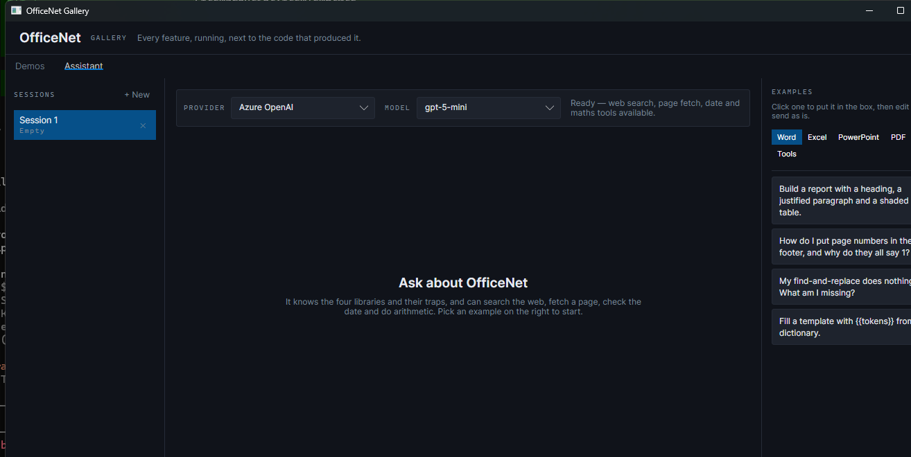
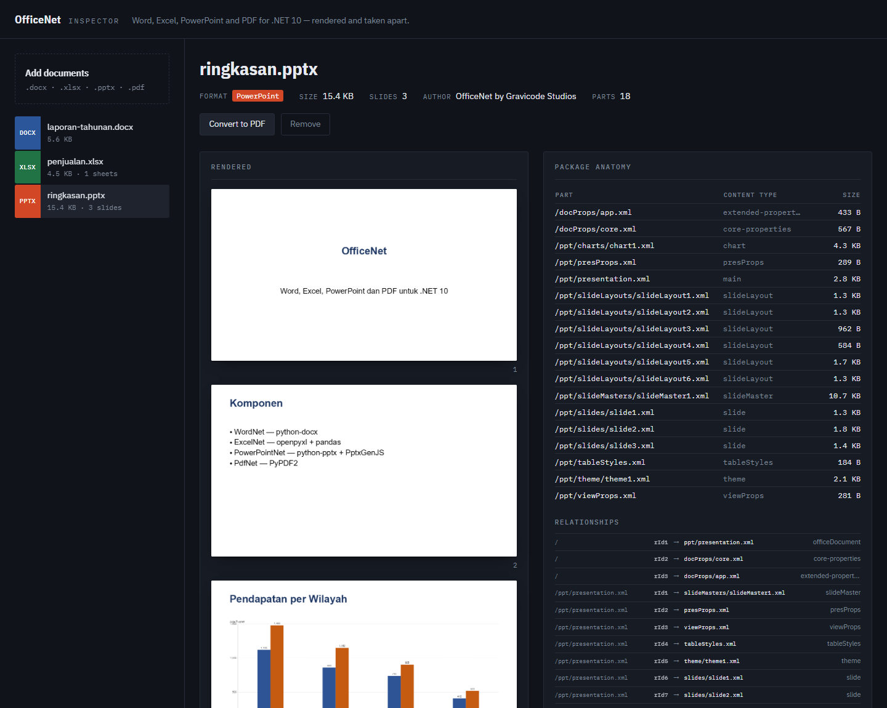

# OfficeNet

[Bahasa Indonesia](README.id.md)

Word, Excel, PowerPoint and PDF for .NET 10 — no Office install, no native dependency, identical
output on Windows, Linux and macOS.

OfficeNet is a rewrite of the Python document stack. Each library mirrors one of the originals and
keeps its shape, so if you know the Python you already know the API.

| Package | Rewrite of | What it does |
|---|---|---|
| `Gravicode.OfficeNet.WordNet` | python-docx | `.docx` — paragraphs, styles, tables, images, sections, headers, mail merge |
| `Gravicode.OfficeNet.ExcelNet` | openpyxl + pandas | `.xlsx` — cells, formulas, styles, charts data, CSV/JSON/SQL, DataFrames |
| `Gravicode.OfficeNet.PowerPointNet` | python-pptx + PptxGenJS | `.pptx` — slides, layouts, themes, tables, charts, media, **HTML → slides** |
| `Gravicode.OfficeNet.PdfNet` | PyPDF2 | `.pdf` — merge, split, rotate, extract, forms, encryption, annotations, drawing |
| `Gravicode.OfficeNet.Rendering` | pdf2image | Pages to PNG/JPEG/WebP — the only package with a native dependency |
| `Gravicode.OfficeNet.Core` | — | The OPC container, units, colour and chart model every library shares |
| `Gravicode.OfficeNet` | — | Meta package pulling in all of the above, plus the `Office` facade |

*Dibuat oleh Gravicode Studios, dipimpin oleh Kang Fadhil.*

---

## What it produces

Every image below is generated by [`tools/ScreenshotGen`](tools/ScreenshotGen) from the libraries'
own output and rendered through `OfficeNet.Rendering` — never captured from Word, Excel or
PowerPoint. Re-running the tool regenerates them, so they cannot drift away from what the code
actually does.

| | |
|---|---|
| **WordNet** — headings, styles, header and footer, page-number fields, a shaded table |  |
| **ExcelNet** — typed dates, Rupiah formats, and a `SUM` the engine actually evaluated |  |
| **PowerPointNet** — a native chart, drawn by the PDF exporter from its own cached data |  |
| **HTML → slides** — headings, nested lists and a table become a deck in one call |  |

### The sample applications

**OfficeNet Gallery** — every feature running beside the code that produced it. That source is read
out of the embedded demo file at runtime, so it is literally the code that just executed rather than
a snippet someone copied and forgot to update.



Its assistant answers questions about the libraries, with several conversations at once and example
prompts grouped by library. Verified against live Azure OpenAI and DeepSeek models, with the web
search, date and maths tools all firing.



**OfficeNet Dashboard** — upload a document and see it rendered *and* taken apart: every part in the
OPC container with its content type and size, plus the whole relationship graph. That panel is the
reason the sample exists.



---

## Documentation

Full guides live in [`docs/`](docs/README.md), bilingual throughout. Every code sample on those
pages is compiled and run by the test suite, so none of them can go stale.

| Guide | English | Bahasa Indonesia |
|---|---|---|
| Index | [docs/README.md](docs/README.md) | [docs/id/README.md](docs/id/README.md) |
| Core concepts — OPC, units, colour, metadata | [Core.md](docs/Core.md) | [id/Core.md](docs/id/Core.md) |
| WordNet | [WordNet.md](docs/WordNet.md) | [id/WordNet.md](docs/id/WordNet.md) |
| ExcelNet | [ExcelNet.md](docs/ExcelNet.md) | [id/ExcelNet.md](docs/id/ExcelNet.md) |
| PowerPointNet | [PowerPointNet.md](docs/PowerPointNet.md) | [id/PowerPointNet.md](docs/id/PowerPointNet.md) |
| PdfNet | [PdfNet.md](docs/PdfNet.md) | [id/PdfNet.md](docs/id/PdfNet.md) |
| Rendering | [Rendering.md](docs/Rendering.md) | [id/Rendering.md](docs/id/Rendering.md) |
| Unified API and plugins | [OfficeNet.md](docs/OfficeNet.md) | [id/OfficeNet.md](docs/id/OfficeNet.md) |

And elsewhere in the repository:

- **[samples/](samples/README.md)** — five applications: two CLI, a Blazor dashboard, and two
  Avalonia apps including the Gallery
- **[notebooks/](notebooks/README.md)** — Polyglot notebooks, one per library; the fastest way to
  try the API without creating a project
- **[benchmarks/](benchmarks/README.md)** — BenchmarkDotNet results, and the two quadratic paths
  running them uncovered
- **[Plan.md](Plan.md)** — the roadmap, and what is deliberately out of scope
- **[Progress.md](Progress.md)** — what is done, verified, and still open

---

## Install

```bash
dotnet add package Gravicode.OfficeNet          # everything
dotnet add package Gravicode.OfficeNet.WordNet  # or just the one you need
```

## Quick start

### Word

```csharp
using WordNet;
using OfficeNet.Core;

using var doc = WordDocument.Create();
doc.Properties.Title = "Annual Report";

doc.Section.SetPageSize("A4");
doc.Section.SetMargins(Units.Cm(2.5));

doc.AddHeading("Annual Report", 0);
doc.AddParagraph("Prepared by Gravicode Studios.", "Subtitle");

doc.AddHeading("Summary", 1);
var p = doc.AddParagraph();
p.Alignment = ParagraphAlignment.Justify;
p.AddRun("Revenue grew ");
p.AddRun("32%", bold: true);
p.AddRun(" year on year.");

doc.AddList(["Word", "Excel", "PowerPoint", "PDF"]);

doc.AddTable(new[]
{
    new[] { "Region", "Revenue" },
    new[] { "Jakarta", "1,250" },
    new[] { "Bandung", "980" },
});

doc.Save("report.docx");
doc.SaveAsPdf("report.pdf");
```

### Excel

```csharp
using ExcelNet;
using ExcelNet.Styles;

using var wb = Workbook.Create("Sales");
var sheet = wb["Sales"];

sheet.WriteHeader("A1", ["Date", "Product", "Qty", "Price", "Total"]);

sheet["A2"].Set(new DateTime(2026, 1, 15));
sheet["B2"].Set("WordNet");
sheet["C2"].Set(12);
sheet["D2"].Set(85_000.0).WithNumberFormat(NumberFormats.Rupiah);
sheet["E2"].SetFormula("C2*D2").WithNumberFormat(NumberFormats.Rupiah);

sheet["E3"].SetFormula("SUM(E2:E2)");
wb.Recalculate();                 // fills the cached results Excel would compute on open

Console.WriteLine(sheet["E2"].Number);   // 1020000

sheet.AddColorScale("C2:C100", OfficeColor.Red, OfficeColor.Green);
sheet.AutoFitColumns();

wb.Save("sales.xlsx");
wb.SaveAsPdf("sales.pdf");
```

**DataFrames.** ExcelNet does not reimplement pandas — it bridges to
[GraviFrame](https://github.com/DotNetVibeCoderz/Vibe_ML/tree/main/GravicodeScience), the pandas
analogue Gravicode Studios already built:

```csharp
using ExcelNet.DataFrames;

var frame = sheet.ToDataFrame();
var byRegion = frame.GroupBy("Region").Sum("Total");
wb.WriteDataFrame(byRegion, "Summary");
```

### PowerPoint

```csharp
using PowerPointNet;
using PowerPointNet.Charts;

using var deck = Presentation.Create();          // 16:9, master + 6 layouts + theme

deck.AddTitleSlide("OfficeNet", "Four libraries, one API");
deck.AddBulletSlide("Components", ["WordNet", "ExcelNet", "PowerPointNet", "PdfNet"]);

var slide = deck.AddSlide(2);
slide.SetTitle("Revenue by region");
slide.AddChart(new ChartData
{
    Type = ChartType.Column,
    Categories = ["Jakarta", "Bandung", "Surabaya"],
    Series = [new ChartSeries("2026", [150, 110, 105])],
    ValueFormat = "#,##0",
    ShowDataLabels = true,
});

deck.Save("deck.pptx");
deck.SaveAsPdf("deck.pdf");
```

**HTML → slides**, the feature PptxGenJS calls `html2ppt`:

```csharp
using PowerPointNet.Html;

using var deck = HtmlToSlides.CreatePresentation(html, new HtmlSlideOptions
{
    TitleSlide = "Q1 Review",
    SplitOnHeadingLevel = 2,     // h1 and h2 start a new slide
});
```

Headings become slide titles, content below them becomes the body, and anything that does not fit
paginates onto a continuation slide. Inline formatting — bold, italic, underline, colour, font,
size, links — survives run by run. `TableToSlides` splits one large table across as many slides as
it needs, repeating the header row.

### PDF

```csharp
using PdfNet.Document;
using PdfNet.Content;

// Merge, split, rotate
using var merged = PdfDocument.ConcatFiles(["a.pdf", "b.pdf"]);
merged.Pages.RotateAll(90);
merged.Save("merged.pdf");

// Extract
using var source = PdfDocument.Open("scan.pdf");
Console.WriteLine(source.ExtractText());
foreach (var image in source.Pages[0].ExtractImages())
    image.SaveTo("out");

// Draw
using var doc = PdfDocument.Create();
var page = doc.Pages.Add(PageSize.A4);
using (var canvas = page.OpenCanvas())
{
    canvas.TopDown = true;
    canvas.SetFont(StandardFont.HelveticaBold, 22);
    canvas.DrawText("Invoice", 50, 60);
}

// Encrypt — AES-256 by default
doc.Encrypt("user-password", "owner-password", PdfPermissions.Print);
doc.Save("invoice.pdf");
```

Forms fill and flatten, annotations and watermarks are one call each:

```csharp
var form = AcroForm.Open(doc)!;
form.Fill(new Dictionary<string, string?> { ["name"] = "Kang Fadhil" });
form.Flatten();

page.AddHighlight([new PdfRectangle(50, 700, 200, 715)]);
page.AddWatermark("DRAFT");
```

---

## Design notes

**PdfNet is the leaf.** Word, Excel and PowerPoint all export *through* it, so PDF export needs no
extra dependency and behaves the same from all three.

**Everything is one OPC container.** `.docx`, `.xlsx` and `.pptx` differ only in which parts go
inside; `OfficeNet.Core` implements the container once and all three inherit packaging,
relationships, units, colour, image sniffing and metadata.

**Parts the library does not model survive a round trip.** Open a file, change one paragraph, save:
macros, custom XML, pivot caches and vendor extensions all come back byte for byte.

**Formatting is tri-state.** `null` means inherit, `false` means explicitly off. That is what lets
you write an unbolded word inside a bold heading — a distinction a plain `bool` cannot express.

**Adding a format takes a handler, not a fork.** `Office` consults a registry, so `.vsdx`, `.one` or
something of your own joins `Office.Open` and `Office.ExtractText` by implementing one interface.
Built-in formats always win, so a plugin can never change how existing files are read —
[details](docs/OfficeNet.md#adding-a-format).

**Verified against an independent reader.** A `.docx` this library writes and this library reads
proves nothing about whether Word can open it, so every format is checked by a validator that
shares no code with the library: content-type coverage, relationship resolution, schema child
order, and the format-specific invariants Office enforces.

## Building

```bash
dotnet build OfficeNet.sln -c Release
dotnet test
```

389 tests, zero warnings.

## What is not implemented

Honest gaps, tracked in [Progress.md](Progress.md) and [Plan.md](Plan.md):

- **WordNet** — footnotes, endnotes, comments, text boxes
- **ExcelNet** — data validation, sheet protection, `INDEX`/`MATCH`/`XLOOKUP`, a streaming writer
- **PowerPointNet** — SmartArt, video export, motion-path animation
- **PdfNet** — PDF → Word/Excel conversion, TrueType font embedding, digital signatures
- Word→PDF export handles flow layout, not floating objects, footnotes or hyphenation
- A **pivot table** writes its cache and layout; Excel computes the result grid when it opens the
  file, so a non-Excel consumer sees that area empty. [Why](docs/ExcelNet.md#pivot-tables).
- The **renderer** draws paths, images and text, but substitutes a system font for the file's
  embedded one and does not do gradients, patterns or clipping. It is for thumbnails and previews,
  not a viewer.

## Licence

MIT. *Dibuat oleh Gravicode Studios, dipimpin oleh Kang Fadhil.*
