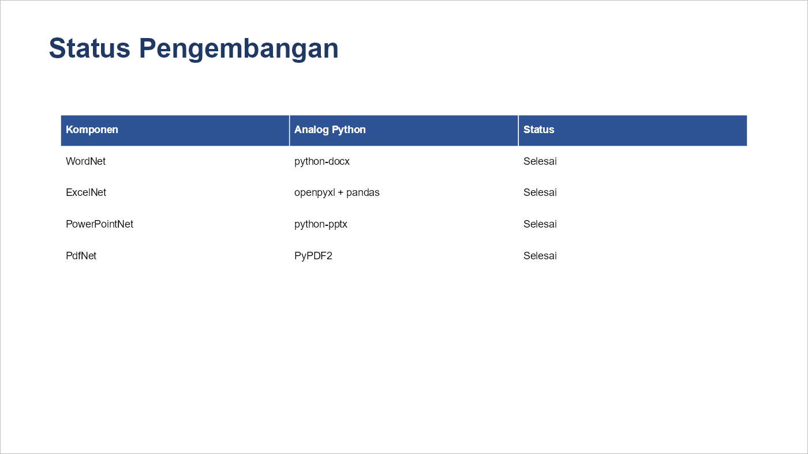

# PowerPointNet

`.pptx` presentations for .NET 10 — python-pptx's model, plus the features that make PptxGenJS
useful: HTML → slides, native charts, media and shape effects.

*Bahasa Indonesia: [docs/id/PowerPointNet.md](id/PowerPointNet.md)* · [Back to index](README.md)

Dibuat oleh Gravicode Studios, dipimpin oleh Kang Fadhil.

```bash
dotnet add package Gravicode.OfficeNet.PowerPointNet
```

---

| | |
|---|---|
|  |  |

*Both slides come from the code on this page. The chart is a **native PowerPoint chart** — the
numbers travel with it and the theme restyles it — drawn here by the PDF exporter from its own
cached data.*

---

## Opening and saving

```csharp
using PowerPointNet;

using var deck = Presentation.Create();          // 16:9 by default
using var existing = Presentation.Open("deck.pptx");
using var fromTemplate = Presentation.FromTemplate("brand.potx");

deck.UseWidescreen();    // 13.333 x 7.5 in
deck.UseStandard();      // 10 x 7.5 in

deck.Save("deck.pptx");
deck.SaveAsPdf("deck.pdf");
```

## Slides

```csharp
deck.AddTitleSlide("OfficeNet", "Word, Excel, PowerPoint dan PDF untuk .NET 10");

deck.AddBulletSlide("Komponen", [
    "WordNet — python-docx",
    "ExcelNet — openpyxl + pandas",
    "PowerPointNet — python-pptx + PptxGenJS",
    "PdfNet — PyPDF2",
]);

deck.AddSectionSlide("Bagian II");

var slide = deck.AddSlide(layoutIndex: 1);   // Title and Content
slide.SetTitle("Judul");
slide.SetBody(["Butir satu", "Butir dua"]);

deck.MoveSlide(3, 0);
deck.DuplicateSlide(0);
deck.RemoveSlide(4);
deck.ReverseSlides();
```

The default master ships six layouts, in this order:

| Index | Layout |
|---|---|
| 0 | Title Slide |
| 1 | Title and Content |
| 2 | Title Only |
| 3 | Blank |
| 4 | Two Content |
| 5 | Section Header |

That is **not** PowerPoint's own ordering, and a template will have its own. Look one up by name
rather than hard-coding an index when the deck comes from a template:

```csharp
var layout = deck.FindLayout("Blank") ?? deck.Layouts[3];
deck.AddSlide(layout);
```

An out-of-range index is clamped rather than throwing, so `AddSlide(99)` quietly gives you the last
layout — another reason to look up by name.

## Text

```csharp
var box = slide.AddTextBox("Halo", Units.Inches(1), Units.Inches(2),
    Units.Inches(4), Units.Inches(1));

box.TextFrame!.Text = "Baris pertama\nBaris kedua";

var paragraph = box.TextFrame.AddParagraph("Butir");
paragraph.Level = 1;
paragraph.Alignment = TextAlignment.Center;
paragraph.HasBullet = true;

var run = paragraph.AddRun("tebal");
run.Bold = true;
run.FontSize = Units.Pt(24);
run.Color = OfficeColor.FromRgb(0x1F, 0x38, 0x64);
```

`TextFrame` is nullable, because a picture or a chart has none. A text box or an autoshape always
does, which is why `!` is the honest thing to write on one you just created — and why reading text
off an arbitrary shape needs `?.`.

## Shapes and effects

```csharp
var shape = slide.AddShape(ShapeGeometry.RoundedRectangle,
    Units.Inches(1), Units.Inches(1), Units.Inches(3), Units.Inches(1.5));

shape.WithFill(OfficeColor.FromRgb(0x1F, 0x38, 0x64))
     .WithOutline(OfficeColor.White, Units.Pt(2))
     .WithShadow(blur: Units.Pt(8))
     .WithHyperlink("https://github.com/DotNetVibeCoderz/Vibe_Office");

slide.AddShape(ShapeGeometry.Ellipse, /* … */)
     .WithGradientFill(
         OfficeColor.FromRgb(0x1F, 0x38, 0x64),
         OfficeColor.FromRgb(0x63, 0x8E, 0xC6),
         GradientDirection.DiagonalDown)
     .WithGlow(OfficeColor.White, Units.Pt(6));
```

The effect methods are generic extensions that return the shape they were given, so they chain and
work on pictures and tables as well as autoshapes.

## Tables

```csharp
var table = slide.AddTable(rows: 5, columns: 3,
    Units.Inches(1), Units.Inches(1.9),
    deck.SlideWidth - Units.Inches(2), Units.Inches(2.6));

table.SetData(new[]
{
    new[] { "Komponen", "Analog Python", "Status" },
    new[] { "WordNet", "python-docx", "Selesai" },
    new[] { "ExcelNet", "openpyxl + pandas", "Selesai" },
});

table[0, 0].Text = "Komponen";
table.SetColumnWidth(0, Units.Inches(3));
```

## Charts

A chart in a `.pptx` is data, not a picture: the numbers travel with it, the theme restyles it, and
a reader can hover a bar and see its value.

```csharp
using PowerPointNet.Charts;

slide.AddChart(new ChartData
{
    Type = ChartType.Column,
    Categories = ["Jakarta", "Bandung", "Surabaya", "Medan"],
    Series =
    [
        new ChartSeries("2025", [1120, 860, 740, 410]),
        new ChartSeries("2026", [1480, 1150, 905, 520]),
    ],
    ValueAxisTitle = "Juta Rupiah",
    ValueFormat = "#,##0",
    ShowDataLabels = true,
    Legend = LegendPosition.Bottom,
});
```

Twelve types: `Column`, `ColumnStacked`, `Bar`, `BarStacked`, `Line`, `LineMarkers`, `Area`,
`AreaStacked`, `Pie`, `Doughnut`, `Scatter`, `Radar`.

Shorthand for the common cases:

```csharp
ChartData.Simple(ChartType.Pie, "Pangsa", ["A", "B", "C"], [50, 30, 20]);
ChartData.FromMap(ChartType.Bar, "Penjualan", dictionary);
```

Reading a chart back:

```csharp
var chart = slide.Charts.First();
var data = chart.GetData();      // categories, series, labels, format
chart.SetData(data with { Type = ChartType.Line });
```

`GetData` reads the cached values, which is what a viewer displays and everything this library
writes. A chart authored in PowerPoint against an embedded workbook returns its cache too, but not
the formulas behind it.

## SmartArt

```csharp
using PowerPointNet.Diagrams;

slide.AddSmartArt(DiagramKind.Process, "Kumpulkan", "Olah", "Laporkan");
```

Five kinds: `List` (boxes stacked down the slide), `Process` (chevrons across it), `Cycle` (a ring
with arrows), `Hierarchy` (a tree) and `Pyramid` (stacked bands). Colours are the caller's, and
position and size have an overload each:

```csharp
var diagram = slide.AddSmartArt(DiagramKind.Cycle,
    [new DiagramNode("Rencana"), new DiagramNode("Kerjakan"), new DiagramNode("Periksa")],
    Units.Cm(3), Units.Cm(4), Units.Cm(18), Units.Cm(10),
    fill: OfficeColor.FromRgb(0x1F, 0x3A, 0x5F),
    text: OfficeColor.White);
```

`Hierarchy` is the only kind that draws children, and `DiagramNode.With` builds them:

```csharp
slide.AddSmartArt(DiagramKind.Hierarchy,
[
    DiagramNode.With("Direktur",
        DiagramNode.With("Operasi", new DiagramNode("Gudang"), new DiagramNode("Armada")),
        DiagramNode.With("Keuangan", new DiagramNode("Penagihan"))),
]);
```

The other kinds flatten the tree into a list rather than dropping the deeper levels, so nothing
disappears silently.

`slide.Diagrams` finds them again, and `diagram.Nodes` reads the text back out of the data model.

### What is in the file, and where the boundary is

A diagram is **five parts**, not one: `data` (the nodes and how they connect), `layout`, `colors`,
`quickStyle`, plus a Microsoft extension part holding the rendered shapes. The slide points at the
first four through a single `dgm:relIds` element naming all four relationship ids; the *data* part
points at the fifth.

`layout` is the interesting one. It is not a picture — it is an **algorithm**, a constraint system
PowerPoint solves at draw time to decide where each node goes. Reimplementing that is not a thing a
library does in an afternoon, and shipping a hollow one gives a diagram that opens as a blank
rectangle.

So OfficeNet computes the geometry itself and writes it into the drawing part, which is exactly what
PowerPoint caches there. That part is what every consumer draws: PowerPoint, LibreOffice, Google
Slides, and this library's own PDF export. **The moment someone edits the diagram in PowerPoint, it
re-runs its own engine and the shapes move to wherever it decides.** The content stays; the exact
placement becomes PowerPoint's. That is a real boundary, and it is the same one PowerPoint puts on
its own cached drawing.

## SmartArt

```csharp
using PowerPointNet.Diagrams;

slide.AddSmartArt(DiagramKind.Process, "Kumpulkan", "Olah", "Laporkan");
```

Five kinds: `List` (boxes stacked down the slide), `Process` (chevrons across it), `Cycle` (a ring
with arrows), `Hierarchy` (a tree) and `Pyramid` (stacked bands). Colours are the caller's, and
position and size have an overload each:

```csharp
var diagram = slide.AddSmartArt(DiagramKind.Cycle,
    [new DiagramNode("Rencana"), new DiagramNode("Kerjakan"), new DiagramNode("Periksa")],
    Units.Cm(3), Units.Cm(4), Units.Cm(18), Units.Cm(10),
    fill: OfficeColor.FromRgb(0x1F, 0x3A, 0x5F),
    text: OfficeColor.White);
```

`Hierarchy` is the only kind that draws children, and `DiagramNode.With` builds them:

```csharp
slide.AddSmartArt(DiagramKind.Hierarchy,
[
    DiagramNode.With("Direktur",
        DiagramNode.With("Operasi", new DiagramNode("Gudang"), new DiagramNode("Armada")),
        DiagramNode.With("Keuangan", new DiagramNode("Penagihan"))),
]);
```

The other kinds flatten the tree into a list rather than dropping the deeper levels, so nothing
disappears silently.

`slide.Diagrams` finds them again, and `diagram.Nodes` reads the text back out of the data model.

### What is in the file, and where the boundary is

A diagram is **five parts**, not one: `data` (the nodes and how they connect), `layout`, `colors`,
`quickStyle`, plus a Microsoft extension part holding the rendered shapes. The slide points at the
first four through a single `dgm:relIds` element naming all four relationship ids; the *data* part
points at the fifth.

`layout` is the interesting one. It is not a picture — it is an **algorithm**, a constraint system
PowerPoint solves at draw time to decide where each node goes. Reimplementing that is not a thing a
library does in an afternoon, and shipping a hollow one gives a diagram that opens as a blank
rectangle.

So OfficeNet computes the geometry itself and writes it into the drawing part, which is exactly what
PowerPoint caches there. That part is what every consumer draws: PowerPoint, LibreOffice, Google
Slides, and this library's own PDF export. **The moment someone edits the diagram in PowerPoint, it
re-runs its own engine and the shapes move to wherever it decides.** The content stays; the exact
placement becomes PowerPoint's. That is a real boundary, and it is the same one PowerPoint puts on
its own cached drawing.

## Pictures and media

```csharp
slide.AddPicture("logo.png", Units.Inches(1), Units.Inches(1), width: Units.Inches(3));

slide.AddVideo("demo.mp4", Units.Inches(1), Units.Inches(1),
    Units.Inches(6), Units.Inches(3.4), autoPlay: true);

slide.AddAudio("narasi.m4a", Units.Inches(1), Units.Inches(5));
slide.AddOnlineVideo("https://www.youtube.com/watch?v=…", /* … */);
```

An embedded clip needs *two* relationships — one `video`/`audio` and one `media` — pointing at the
same part. PowerPoint silently drops a clip that has only one, which is the usual reason a
hand-built deck plays nothing.

## HTML → slides

The PptxGenJS feature people actually come for. Give it HTML, get a deck.

```csharp
using PowerPointNet.Html;

using var deck = HtmlToSlides.CreatePresentation(html, new HtmlSlideOptions
{
    TitleSlide = "Tinjauan Kuartal",
    SubtitleSlide = "Disusun otomatis",
    SplitOnHeadingLevel = 2,     // a new slide at each <h2>
    MaxLinesPerSlide = 9,        // overflow continues on the next slide
});

deck.Save("dari-html.pptx");
```


Understood: `h1`–`h6`, `p`, `ul`/`ol`/`li` with nesting mapped to bullet levels, `table`/`tr`/`th`/
`td`, `img`, `strong`/`b`, `em`/`i`, `u`, `code`, `br`, `hr`, `blockquote`, and inline `style`
attributes for colour, size, weight and alignment.

Long content splits across continuation slides rather than overflowing off the bottom — that
threshold is `MaxLinesPerSlide` and `MaxTableRowsPerSlide`.

Other entry points:

```csharp
HtmlToSlides.CreatePresentationFromFile("laporan.html");
HtmlToSlides.Convert(existingDeck, html);          // append into a deck you already have
HtmlToSlides.TableToSlides(existingDeck, html);    // just the tables, paginated
```

Images are resolved relative to `BaseDirectory`, or by your own `ImageResolver` when they live
somewhere the file system cannot reach:

```csharp
new HtmlSlideOptions
{
    ImageResolver = url => httpClient.GetByteArrayAsync(url).Result,
}
```

## Transitions, animation and notes

```csharp
slide.SetTransition(SlideTransition.Fade, TimeSpan.FromSeconds(0.7));
slide.AnimateOnClick(AnimationEffect.Fade, shape1, shape2);
slide.Notes = "Sebutkan angka pertumbuhan di sini.";
slide.IsHidden = true;
slide.BackgroundColor = OfficeColor.FromRgb(0xF2, 0xF2, 0xF2);
```

Animation is click-ordered only. Motion paths and triggers need a full SMIL timing tree and are on
the [roadmap](../Plan.md).

### Animation

```csharp
using PowerPointNet.Animations;

slide.Animate(
    Animation.Entrance(title, AnimationEffectKind.Fade),
    Animation.Entrance(bullet1, AnimationEffectKind.Fly).From(AnimationDirection.Left),
    Animation.Entrance(bullet2, AnimationEffectKind.Fly).WithPrevious(),
    Animation.Emphasis(logo, AnimationEffectKind.Spin).AfterPrevious(),
    Animation.Exit(cover).Lasting(TimeSpan.FromSeconds(1)),
    Animation.Motion(arrow, MotionPath.Line(0.3, 0)).OnClickOf(button));
```

Four classes, and they are not interchangeable: an **entrance** leaves the shape visible, an **exit**
leaves it hidden, an **emphasis** assumes it was visible already, and a **motion path** moves it.
Pairing an effect with the wrong class throws rather than writing a file PowerPoint opens and plays
nothing from.

| Class | Effects |
| --- | --- |
| `Entrance`, `Exit` | `Appear`, `Fade`, `Fly`, `Wipe`, `Zoom` |
| `Emphasis` | `Pulse`, `Spin`, `Grow` |
| `MotionPath` | `Move`, via a `MotionPath` |

**The order is the click order**, and it is also what `WithPrevious()` and `AfterPrevious()` attach
to — both mean "the animation before this one in this list". Only `OnClick` starts a new click;
the other two join the click already open, which is the difference between a three-part build and
three separate clicks.

`OnClickOf(shape)` is the exception. It does not take a turn in the click order: it goes into its own
sequence keyed to that shape and fires whenever the shape is clicked, however many times. That is
what makes a slide interactive — a button that reveals an answer.

`Lasting()` and `After()` set the duration and the delay. `HasAnimations` says whether a slide has
any, and `ClearAnimations()` removes them.

#### Motion paths

```csharp
MotionPath.Line(0.3, -0.1);                         // a third of the slide right, a tenth up
MotionPath.Through((0.1, 0), (0.1, 0.2), (0, 0.2)); // three legs
MotionPath.Rectangle(0.25, 0.1);                    // a closed loop
MotionPath.Custom("M 0 0 C 0.2 -0.3 0.4 0.3 0.6 0 E");
```

Coordinates run 0 to 1 across the slide and down it, **relative to where the shape already is**. So
`0.25` means a quarter of the slide's width from the shape's own position, not a quarter of the way
across the slide — reading it as absolute is why a hand-written motion path so often sends the shape
off the edge.

#### What is written, and what PowerPoint makes of it

The animation model is SMIL: a time root, sequences under it, click groups under those, and under
each group the behaviours that change something. Even a single "fade in on click" is four levels of
`p:par` before anything happens.

The behaviours are what plays. The `presetID` attribute alongside them only tells PowerPoint's
animation pane which gallery entry this is, so it is written for the documented entrance and exit
numbers and left off elsewhere rather than guessed: PowerPoint then labels the effect "Custom" and
plays it exactly as written, which beats a wrong label on an effect nobody can then edit sensibly.

Animations are not read back into the model. Recognising every effect PowerPoint can write is a much
larger job than writing the ones here, and reporting a slide as having no animations because one of
them was unfamiliar would be worse than not offering to read them at all — so `Animate` replaces
whatever a slide had, and `HasAnimations` is all the reader there is.


## Themes

```csharp
deck.Master!.SetThemeColor("accent1", OfficeColor.FromRgb(0x1F, 0x38, 0x64));
deck.Master.SetThemeFonts(majorFont: "Poppins", minorFont: "Inter");
```

Setting a theme colour restyles every shape that uses it, which is the point of a theme — a shape
given an explicit colour does not follow.

## Reading a deck

```csharp
using var deck = Presentation.Open("deck.pptx");

Console.WriteLine(deck.ExtractText());

foreach (var slide in deck.Slides)
{
    Console.WriteLine($"#{slide.SlideNumber} {slide.Title?.TextFrame?.Text}");

    foreach (var table in slide.Tables) { /* … */ }
    foreach (var chart in slide.Charts) { /* … */ }
    foreach (var picture in slide.Pictures) { /* … */ }
}
```

## PDF export

```csharp
deck.SaveAsPdf("deck.pdf", new SlidePdfOptions
{
    IncludeHiddenSlides = false,
    IncludeNotes = true,
    IncludeImages = true,
});
```

Text, placeholders, autoshapes with fills and outlines, pictures, tables and **charts** are drawn.
Gradients, 3-D effects, SmartArt and animation are not.

## Common mistakes

**`AddTitleSlide` throws on a custom template.** The layout has no `subTitle` placeholder;
PowerPointNet falls back to the body placeholder, but a layout with neither cannot take a subtitle.
Use `AddSlide(layout)` and `SetTitle` instead.

**A table or chart reads back as a plain `Shape`.** Both live in a `graphicFrame` and are told apart
by the `graphicData/@uri`. If you built the frame by hand, that attribute is what is missing.

**A video does not play.** Only one of the two required relationships was written.

**Slide IDs.** `sldId` must be at least 256. The library handles it; hand-edited XML must too.

## See also

- [Core concepts](Core.md) — EMU, units and colour
- [Rendering](Rendering.md) — slides to PNG
- `notebooks/PowerPointNet.ipynb` — the same material, runnable
