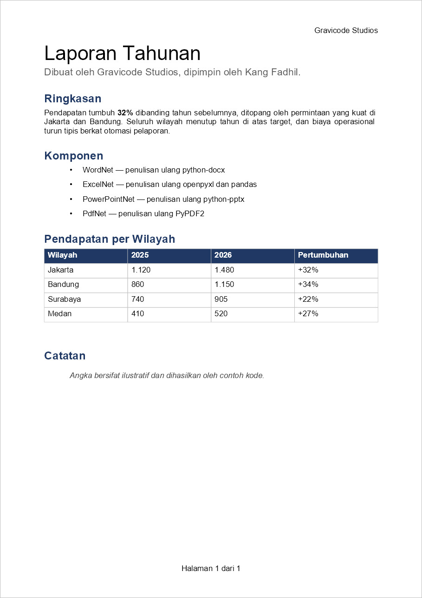
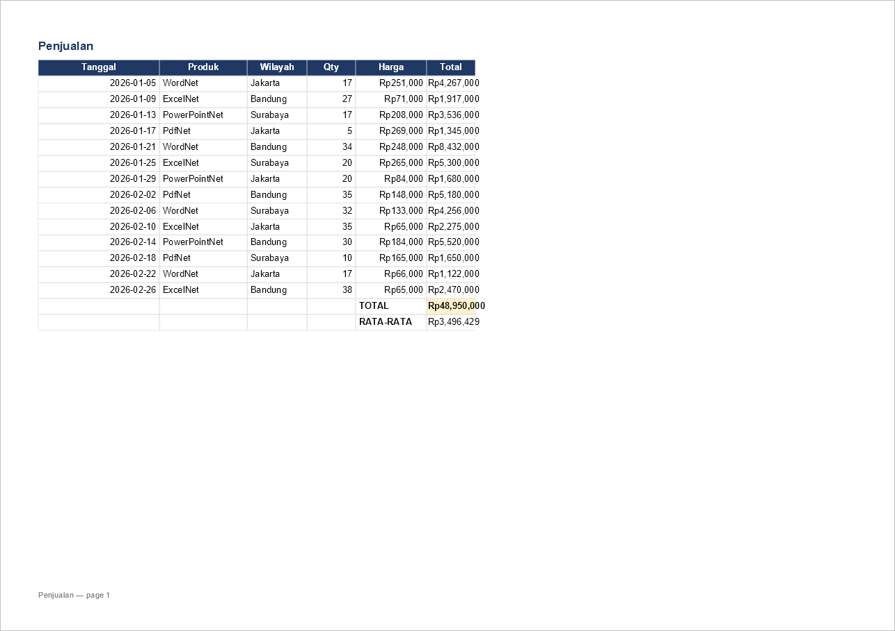
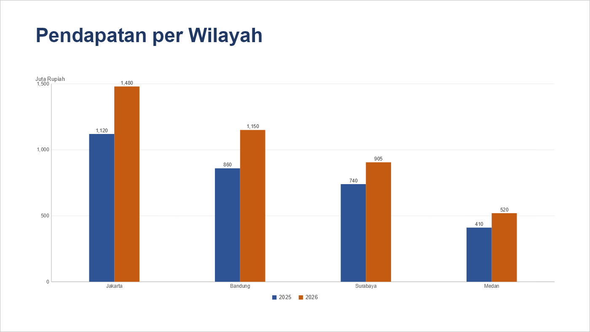
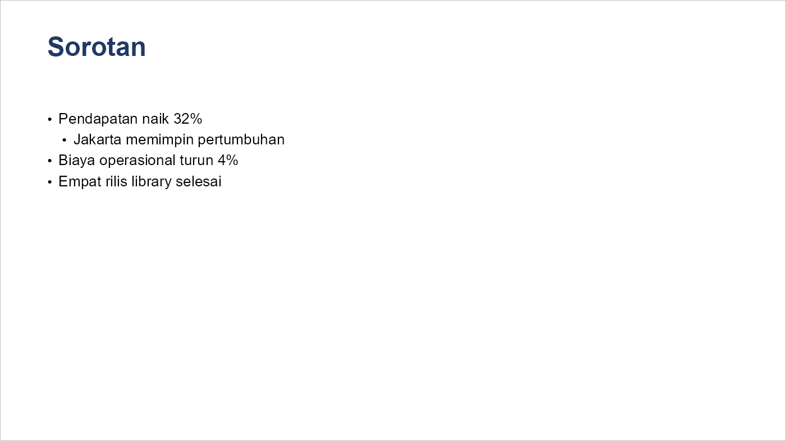

# Dokumentasi OfficeNet

Word, Excel, PowerPoint, dan PDF untuk .NET 10 — tanpa instalasi Office, tanpa COM, tanpa dependensi
native di inti, hasil identik di Windows, Linux, dan macOS.

*English: [docs/README.md](../README.md)*

Dibuat oleh Gravicode Studios, dipimpin oleh Kang Fadhil.

---

## Library-nya

| Paket | Namespace | Menggantikan | Panduan |
|---|---|---|---|
| `Gravicode.OfficeNet.WordNet` | `WordNet` | python-docx | [WordNet](WordNet.md) |
| `Gravicode.OfficeNet.ExcelNet` | `ExcelNet` | openpyxl + pandas | [ExcelNet](ExcelNet.md) |
| `Gravicode.OfficeNet.PowerPointNet` | `PowerPointNet` | python-pptx + PptxGenJS | [PowerPointNet](PowerPointNet.md) |
| `Gravicode.OfficeNet.PdfNet` | `PdfNet` | PyPDF2 | [PdfNet](PdfNet.md) |
| `Gravicode.OfficeNet.Rendering` | `OfficeNet.Rendering` | pdf2image / poppler | [Rendering](Rendering.md) |
| `Gravicode.OfficeNet` | `OfficeNet` | — | [API terpadu](OfficeNet.md) |
| `Gravicode.OfficeNet.Core` | `OfficeNet.Core` | — | [Konsep inti](Core.md) |

Pasang yang Anda butuhkan saja; `Gravicode.OfficeNet` menarik keempat library format sekaligus titik
masuk yang tidak peduli formatnya apa.

```bash
dotnet add package Gravicode.OfficeNet
```

## Siapa bergantung pada siapa

```
OfficeNet.Core ──┬── PdfNet ──┬── WordNet
                 │            ├── ExcelNet ── Gravicode.Science.GraviFrame
                 │            └── PowerPointNet
                 │
                 └── OfficeNet.Rendering (SkiaSharp)
```

`PdfNet` adalah daun. Word, Excel, dan PowerPoint semuanya mengekspor *melalui* PdfNet — itulah
sebabnya ada satu mesin layout, bukan empat, dan halaman yang dirender selalu sama dengan PDF yang
akan Anda dapatkan dari dokumen yang sama.

`OfficeNet.Rendering` sengaja dipisah menjadi paket sendiri: rasterisasi adalah satu-satunya bagian
OfficeNet yang butuh dependensi native, dan menjauhkannya dari inti itulah yang membuat "identik di
setiap platform" menjadi kenyataan, bukan sekadar klaim.

## Tiga puluh detik untuk masing-masing

```csharp
// Word
using var document = WordDocument.Create();
document.AddHeading("Laporan", 0);
document.AddParagraph("Isi paragraf.");
document.Save("laporan.docx");

// Excel
using var workbook = Workbook.Create("Data");
workbook["Data"]["A1"].Set("Total");
workbook["Data"]["B1"].SetFormula("SUM(B2:B10)");
workbook.Recalculate();
workbook.Save("data.xlsx");

// PowerPoint
using var deck = Presentation.Create();
deck.AddTitleSlide("OfficeNet", "Satu API untuk empat format");
deck.Save("deck.pptx");

// PDF
using var pdf = PdfDocument.Open("masukan.pdf");
Console.WriteLine(pdf.ExtractText());

// Semuanya
Office.ConvertToPdf("laporan.docx", "laporan.pdf");
```

## Seperti apa hasilnya

Setiap gambar di bawah dihasilkan oleh [`tools/ScreenshotGen`](../../tools/ScreenshotGen) dari
keluaran library itu sendiri — dirender lewat `OfficeNet.Rendering`, bukan ditangkap dari aplikasi
mana pun. Menjalankan ulang tool-nya membuat gambar ini dibuat ulang, sehingga tidak mungkin
menyimpang dari apa yang sebenarnya dilakukan kodenya.

| | |
|---|---|
| **WordNet** — heading, style, header/footer, field nomor halaman, tabel berwarna<br>[panduan lengkap](WordNet.md) |  |
| **ExcelNet** — sel bertipe, formula dihitung, format angka, autofit<br>[panduan lengkap](ExcelNet.md) |  |
| **PowerPointNet** — chart native yang digambar dari data cache-nya<br>[panduan lengkap](PowerPointNet.md) |  |
| **HTML → slide** — satu panggilan, tanpa penyuntingan manual<br>[panduan lengkap](PowerPointNet.md#html--slide) |  |

## Panduan

- **[Konsep inti](Core.md)** — paket OPC, satuan, warna, metadata. Baca sekali, dan keempat library
  lainnya berhenti membuat Anda terkejut.
- **[WordNet](WordNet.md)** — dokumen, style, tabel, section, mail merge, ekspor PDF.
- **[ExcelNet](ExcelNet.md)** — sel, formula, style, format bersyarat, CSV/JSON/DataFrame.
- **[PowerPointNet](PowerPointNet.md)** — slide, layout, chart, media, konversi HTML.
- **[PdfNet](PdfNet.md)** — gabung, pisah, ekstrak, enkripsi, formulir, anotasi, menggambar.
- **[Rendering](Rendering.md)** — halaman ke PNG/JPEG/WebP, thumbnail.
- **[API terpadu](OfficeNet.md)** — deteksi format dan operasi lintas format.

## Notebook

`notebooks/` berisi satu notebook .NET Interactive per library. Ini cara tercepat mencoba API-nya
tanpa membuat proyek — buka di VS Code dengan ekstensi Polyglot Notebooks lalu jalankan selnya.

## Batasan yang diketahui

Disebutkan terus terang, karena batasan yang Anda ketahui adalah batasan yang bisa Anda siasati:

- **Ekspor PDF adalah mesin layout sungguhan, tapi bukan mesin Word.** Teks mengalir, heading, daftar,
  tabel, gambar, dan field halaman ditata dengan benar. Objek mengambang dengan `wrap="square"`
  digambar inline.
- **Renderer ditujukan untuk thumbnail dan pratinjau.** Ia menggambar path, gambar, teks, clipping,
  dan gradien, serta memakai font tersemat berkasnya bila font itu TrueType. Ia belum menangani
  tiling pattern, soft mask, grup transparansi, dan mesh shading.
- **Mesin formula mengisi cache; ia bukan Excel.** Sekitar 60 fungsi, cukup agar konsumen non-Excel
  melihat angka, bukan sel kosong. Array formula dan iterative calculation di luar cakupan.
- **PDF → Word dan PDF → Excel belum ada.** Ekstraksi teks sudah ada; merekonstruksi paragraf dan
  tabel dari posisi glyph adalah masalah yang berbeda dan ada di [peta jalan](../../Plan.md).

Gambaran lengkapnya ada di [Plan.md](../../Plan.md) (peta jalan) dan [Progress.md](../../Progress.md)
(apa yang sudah selesai dan terverifikasi).
