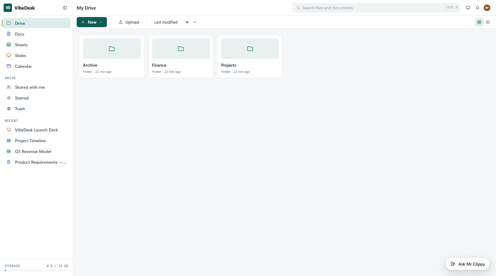
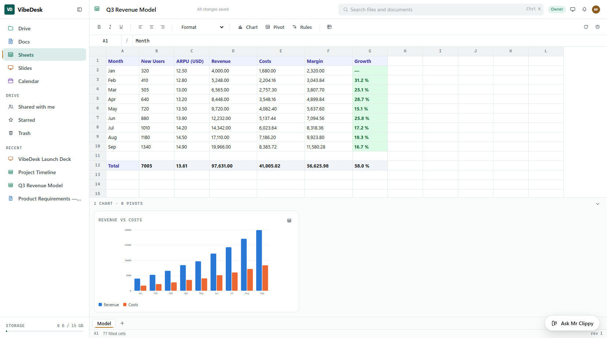
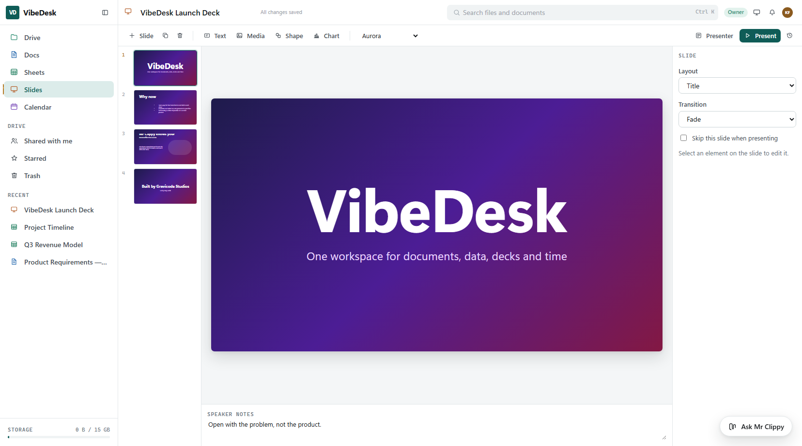
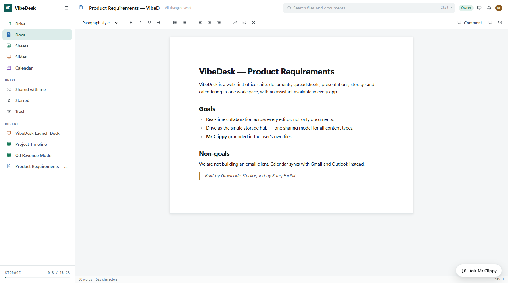
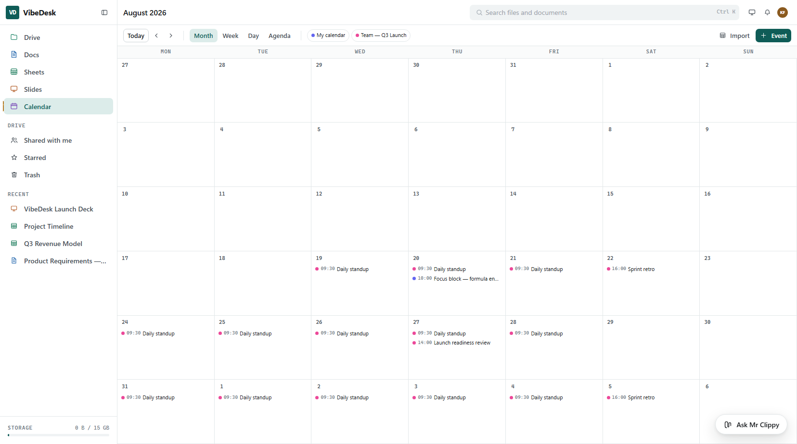
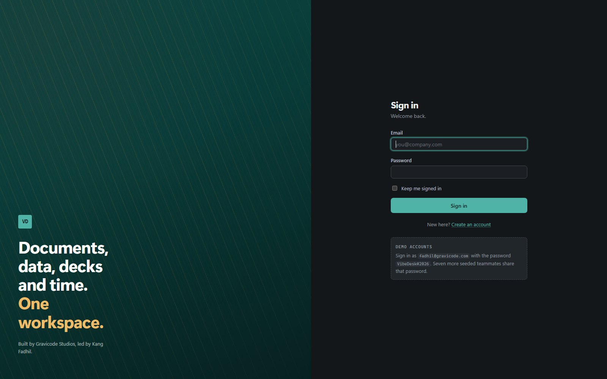

# VibeDesk

**[English](README.md) · [Bahasa Indonesia](README.id.md)**

A self-hosted office suite: documents, spreadsheets, presentations, file storage and a calendar, with
an AI assistant that can read what you have open. Built on .NET 10 and Blazor, it runs as a web app,
a Windows desktop app, or a mobile app from one shared UI.

> Dibuat oleh **Gravicode Studios**, dipimpin oleh **Kang Fadhil**.



---

## The five apps

| | |
|---|---|
| **Drive** | The hub. Every other app stores through it, so permissions, sharing, versioning and activity logging happen in exactly one place. Folder tree, trash, starred, quota. |
| **Docs** | Rich-text editing with comments and tracked suggestions you can accept into the document. |
| **Sheets** | A real formula engine — ~110 functions, cross-sheet references, cycle detection — plus charts, pivot tables and conditional formatting. |
| **Slides** | Six themes, per-slide transitions, speaker notes, presenter view, and live charts pulled from a spreadsheet. |
| **Calendar** | Month, week, day and agenda views over recurring events, reminders, attendees and shared calendars. |

Everything is collaborative: comments and suggestions on documents, share-by-email or share-by-link
with viewer / commenter / editor roles, and full version history with one-click restore.

<table>
<tr>
<td width="50%"></td>
<td width="50%"></td>
</tr>
<tr>
<td></td>
<td></td>
</tr>
</table>

---

## Mr Clippy

An assistant panel present in all five apps, grounded in whatever you currently have open. It keeps
multiple conversations, accepts image and document attachments, and shows you which tools it actually
used rather than asking you to trust the prose.

It runs on **Semantic Kernel** and supports four providers — **OpenAI**, **Anthropic**, **Google
Gemini** and **Ollama** — selectable per conversation. Twelve kernel functions let it search the web,
read a page, download a file, do arithmetic, check the date, and read your own Drive files.

Two design points worth knowing:

- `math.calculate` reuses the *spreadsheet* formula engine rather than a second implementation, so
  arithmetic in chat behaves exactly as it does in a cell.
- The Drive tools take no user-id parameter at all. Every read goes through the same permission
  layer as the UI, so the assistant can only ever see what you could already open.

Works fully offline via Ollama; no API key required for that path.

---

## Scripts and automation

Apps Script, without the single-language constraint. Automate the suite in **JavaScript, Python or
C#** against one API that reaches Docs, Sheets, Slides, Calendar and Drive.

```js
const frame = api.sheets.read(fileId, 'Sales');
const top   = frame.where('amount', '>', 1000).groupBy('region', 'amount', 'sum');

api.sheets.create('Regional summary', top);
api.notify('Summary ready');
```


- **Permissions per script.** Scopes are stored with the script, not passed at the call site, and a
  script can never reach what its owner cannot. A Sheets-only script is only ever a Sheets script.
- **Triggers.** On an event (`item.created`, `content.saved`, `event.created`, …) or on a five-field
  cron schedule resolved in the author's own time zone. Background runs act as the script's owner.
- **An audit log, not a status column.** Every run records the version that ran, the output, and
  every API call it made, including the refused ones.
- **23 templates** across Drive, Sheets, Docs, Slides, Calendar and external APIs (exchange rates,
  commodities, stocks, translation, search, weather).
- **A CLI** — `vibedesk run report.py --scope SheetsRead --input month=2026-08` — so a script can run
  from a terminal or a build step.

Each language is sandboxed on its own terms, and the limits are stated plainly rather than implied:
Python runs on IronPython so **NumPy and pandas cannot load** (a `DataFrame` covers that ground in
all three languages), and a C# script **cannot be interrupted mid-loop**. Read
[docs/scripting.md](docs/scripting.md) before enabling C# authoring for people you do not trust.

---

## Quick start

```bash
git clone <this repo>
cd VibeDesk
dotnet run --project src/VibeDesk.Web
```

Then open <https://localhost:7181>. On first run the app creates a SQLite database, applies
migrations, and seeds sample data — eight users, a folder tree, documents, spreadsheets, decks,
shares, comments and calendars.

**Demo sign-in** (Development only — the seeder refuses to run in any other environment):

| Email | Role |
|---|---|
| `fadhil@gravicode.com` | Admin |
| `sari@gravicode.com` | Member |
| `budi@gravicode.com` | Member |

Password for every demo account: `VibeDesk#2026`



### Enabling the assistant

Put a key in user secrets rather than `appsettings.json`:

```bash
cd src/VibeDesk.Web
dotnet user-secrets set "Assistant:OpenAI:ApiKey" "sk-..."
dotnet user-secrets set "Assistant:Tavily:ApiKey" "tvly-..."   # optional: web search
```

Or run [Ollama](https://ollama.com) locally and no key is needed at all.

### The other hosts

The desktop and mobile apps are clients of the API, so start it first:

```bash
dotnet run --project src/VibeDesk.Api        # https://localhost:7299 — /scalar/v1 for the docs
dotnet run --project src/VibeDesk.Desktop    # native window, Windows/macOS/Linux
dotnet build src/VibeDesk.Mobile -f net10.0-android
```

Point a client somewhere else with `VIBEDESK_Api__BaseAddress`. On the Android emulator the host
machine is `10.0.2.2`, never `localhost` — the mobile host already defaults to that.

---

## Requirements

.NET 10 SDK (`10.0.400`, pinned in `global.json`). Nothing else — the database, cache and file
storage all default to zero-configuration local implementations.

---

## Swapping the backends

Every backend is a configuration change, not a code change.

| | Default (dev) | Also supported |
|---|---|---|
| **Database** | SQLite | SQL Server, MySQL, PostgreSQL |
| **Cache** | In-memory | Redis |
| **File storage** | Local filesystem | Azure Blob, Amazon S3, MinIO |
| **AI** | — | OpenAI, Anthropic, Google Gemini, Ollama |

```jsonc
{
  "Database": { "Provider": "PostgreSql" },
  "Cache":    { "Provider": "Redis" },
  "Storage":  { "Provider": "S3", "EncryptAtRest": true }
}
```

`EncryptAtRest` wraps whichever storage backend you chose in AES-256-GCM, so encryption is available
on all four rather than being a property of one.

Migrations live in one assembly per database provider — EF Core discovers every `Migration` type in
the migrations assembly, so a single shared project would make the four providers collide. All four
are referenced by the host, which is why switching provider needs no rebuild.

---

## Architecture

```
VibeDesk.Domain          entities and enums, no dependencies
VibeDesk.Application     contracts, DTOs, document models, the formula engine
VibeDesk.Infrastructure  EF Core, Identity, storage, cache, service implementations
VibeDesk.Ai              Mr Clippy — Semantic Kernel, providers, kernel functions
VibeDesk.Scripting       script runtimes, the workspace API, triggers, the sandbox
VibeDesk.Ui              the entire UI, pages included, as a Razor class library
VibeDesk.Client          the same contracts, satisfied over HTTP instead of EF Core
VibeDesk.Web             Blazor Server host
VibeDesk.Api             REST + SignalR + gRPC
VibeDesk.Desktop         Photino Blazor Hybrid (Windows/macOS/Linux)
VibeDesk.Mobile          MAUI Blazor (Android)
VibeDesk.Cli             vibedesk — run and manage scripts from a terminal
```

The UI is a class library so the web, desktop and mobile hosts render the same components. Desktop
and mobile deliberately do **not** reference `VibeDesk.Infrastructure` — they talk to the API, which
keeps the ASP.NET Core framework dependency out of client hosts.

Full detail: [docs/architecture.md](docs/architecture.md).

---

## Documentation

| | |
|---|---|
| [Architecture](docs/architecture.md) | Layers, storage model, permissions, concurrency |
| [Configuration](docs/configuration.md) | Every setting, and how to swap each backend |
| [The apps](docs/apps.md) | Drive, Docs, Sheets, Slides, Calendar in detail |
| [The API](docs/api.md) | REST, SignalR and gRPC, and the rules every client needs |
| [Mr Clippy](docs/assistant.md) | Providers, kernel functions, security boundaries |
| [Scripts](docs/scripting.md) | Languages, the workspace API, scopes, triggers, the CLI |
| [Development](docs/development.md) | Commands, migrations, tests, conventions |

---

## Tests

```bash
dotnet run --project tests/VibeDesk.Tests
```

`dotnet test` is not the entry point here: xunit.v3 runs on Microsoft.Testing.Platform, and the
.NET 10 SDK removed the VSTest path for it. The test project is an executable — running it directly
is the reliable route.

---

## Security

Role-based permissions (viewer / commenter / editor / owner) resolved from ownership, direct grants,
inherited folder grants and link sharing — in one indexed query. TOTP two-factor authentication.
Optional AES-256-GCM encryption at rest. API keys stored only as SHA-256 hashes.

Requesting an item you cannot see returns *not found* rather than *forbidden*, so the existence of an
id is never leaked. Uploaded SVG and HTML are never served inline, because an inline SVG from an
upload is stored XSS on our own origin.

---

## License

See the repository for licensing. Built by **Gravicode Studios**, led by **Kang Fadhil**.
