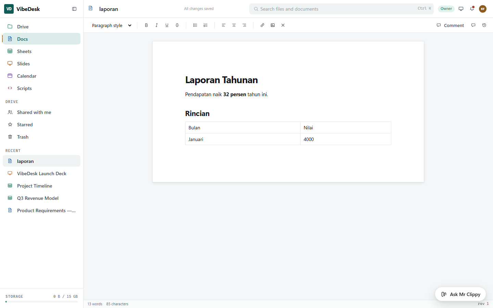

# The five apps

[← README](../README.md) · [Architecture](architecture.md) · [Configuration](configuration.md) · [API](api.md) · [Mr Clippy](assistant.md) · [Scripts](scripting.md) · [Development](development.md)

---

## Drive


The storage hub. Docs, Sheets, Slides and uploaded files are all `DriveItem` rows, so everything below
is shared by all four rather than reimplemented per app.

- Folder tree with breadcrumbs, grid and list views, sorting, and full-text search across names and
  extracted document text
- Starred, Recent, Shared with me, and Trash (soft delete, restorable)
- Sharing by email with **viewer / commenter / editor** roles, or by link with a scope and a link role
- Version history with one-click restore — the restore itself snapshots the current state first, so a
  restore is undoable and no work is ever lost
- Storage quota, enforced on upload; if the quota check fails the uploaded blob is rolled back rather
  than orphaned
- Move, copy (deep, including subtrees), rename, colour-tag

A grant on a folder is inherited by everything beneath it, resolved through the materialised ancestor
path rather than a recursive walk.

---

## Word, Excel and PowerPoint

Uploading a `.docx`, `.xlsx` or `.pptx` **converts it into a real VibeDesk item** rather than parking
it as an attachment: it opens in the editor, is searchable, and takes comments and version history
like anything else. Every document, spreadsheet and presentation exports back out through
**Download as .docx / .xlsx / .pptx** in the Drive menu.



Built on **DocumentFormat.OpenXml** — Microsoft's own SDK, MIT-licensed — so one dependency covers all
three formats in both directions.

### Conversion is lossy, in both directions

VibeDesk stores a document as HTML, a spreadsheet as a sparse cell map, and a deck as a list of
positioned elements. None of those *is* OOXML, so the mapping keeps what has a counterpart on the
other side and drops what does not:

| | Carried | Dropped |
|---|---|---|
| **Word** | Headings, paragraphs, bold/italic/underline/strikethrough, bulleted and numbered lists, tables, hyperlink text, line breaks | Images, footnotes, headers and footers, section breaks, fonts and colours, tracked changes |
| **Excel** | Every sheet, cell values and their types, **formulas**, custom number formats | Fonts, fills, borders, charts, pivot tables, conditional formatting, data validation, merged cells, images |
| **PowerPoint** | Slide order, the text of every text-bearing shape, speaker notes | Images, charts, tables, SmartArt, themes, animations, transitions, exact positioning |

Formulas survive the Excel round trip, which is the part users notice losing first: an exported
workbook contains `=B2*C2`, not the number it happened to evaluate to.

### What is refused, and why

The legacy binary formats — `.doc`, `.xls`, `.ppt` — are **not** imported. They are not OOXML at all,
the SDK cannot read them, and treating one as a document would produce a file full of mojibake. They
upload and download as ordinary attachments instead, which is the honest outcome. Convert them in
Office or LibreOffice first.

A package that fails to convert — corrupt, or password-protected — is also stored as an attachment
rather than rejected. Losing the upload would be worse than not converting it.

Exports are built from the content model on each request, so nothing is stored and an export is always
current. Import happens once, on upload: the item is a VibeDesk document from then on, and the original
package is not kept.

---

## Docs


Rich text over a `contenteditable` surface, stored as HTML.

- Formatting, headings, lists, links, tables, images; page setup for size, orientation, margins, and
  base typography
- **Comments** anchored to a text range, threaded, resolvable
- **Suggestions** — a comment that carries replacement text and can be accepted straight into the
  document body, which then bumps the revision so other editors rebase

The editor's central constraint: **Blazor never re-renders the contenteditable's content.** Assigning
`innerHTML` collapses the caret, so content goes in through JS on first render and on an explicit
revision change only, and the component has no dynamic children at all.

---

## Sheets


A real spreadsheet, not a styled table.

- **~120 functions** across maths, statistics, text, logic, lookup, dates and dynamic arrays
- Formula parsing by a hand-written lexer and recursive-descent parser with spreadsheet precedence:
  comparison → `&` → `+ -` → `* /` → `^` (right-associative) → unary → postfix `%`
- Cross-sheet references (`Data!A1`), absolute markers (`$C$5`), named ranges, empty arguments
  (`IF(A1,,"no")`), and inline array literals (`{1,2;3,4}`)
- **Cycle detection** — a dependency loop yields `#CIRCULAR!` rather than a stack overflow
- Charts (7 kinds, inline SVG), pivot tables, conditional formatting including colour scales
- Frozen rows and columns, number formats, cell notes

### Dynamic arrays

`SEQUENCE`, `SORT`, `UNIQUE`, `FILTER` and `LET` are present, and operators apply elementwise, so
`FILTER(A1:A20, A1:A20>1000)` and `SUM(A1:A20*2)` mean what they look like.

```
=SUM(FILTER(D2:D12, D2:D12>10000))
=INDEX(SORT(UNIQUE(A2:A99)), 1)
=LET(revenue, SUM(D2:D12), revenue - SUM(E2:E12))
```

Two limits worth knowing before you rely on them:

- **They do not spill.** A cell holding `=SEQUENCE(4)` shows `1`, exactly as a cell holding `=A1:A4`
  shows the first value. Spilling needs a shaped value plus grid ownership so a spill can be blocked,
  recalculated and cleared, and that is not built. Wrap the result — `SUM`, `COUNT`, `INDEX`,
  `MATCH`, `XLOOKUP` all take one.
- **Arrays are flat.** A range is already row-major with no width attached, so `{1,2;3,4}` is four
  values rather than two rows of two. `SORT(range, 2)` is therefore refused rather than silently
  sorted by the first column, and `VLOOKUP` still needs a real range for its table.

Evaluation is demand-driven with memoisation, so recalculation costs what the formulas cost, not what
the grid costs. The grid itself is virtualised — a 200-row default sheet renders only what is visible.

Charts ship with a legend **and** a table view. The data-series palette is a validated reference
palette rather than the brand colours: the brand teal cannot reach the required chroma at categorical
lightness in sRGB, and legibility of data outranks palette continuity.

Cell styles store fixed background colours while text uses a theme token, which in dark mode can put
white on white. `ContrastInk()` computes WCAG relative luminance per cell and picks the ink, so a
styled Total row stays readable in both themes.

---

## Slides


- Six themes — aurora, paper, midnight, mint, sunrise, mono
- Element types: text, image, video, audio, shape, chart, table, embed
- Per-slide transitions and per-element animations, speaker notes, hidden slides
- Presenter view and full-screen presentation
- Charts rendered live from a source spreadsheet, so a deck never carries a stale screenshot

Geometry is stored as **percentages** and font sizes in container-query units (`cqw`). One component
therefore renders the editor canvas, the thumbnail rail and the presentation surface identically, with
no layout recomputation per view.

---

## Calendar


- Month, week, day and agenda views
- Recurring events — daily, weekly by day, monthly, yearly, with interval and count/until
- Reminders, attendees with responses, all-day events, colour overrides, visibility
- Multiple calendars per user, shareable with the same role model as Drive
- Attach a Drive item to an event

**Recurrence is expanded on read**, and only *exceptions* are materialised. A series is one row plus a
row per divergence, rather than a row per occurrence — which is what keeps a daily standup from
becoming thousands of rows.

Times are stored in UTC and rendered in the viewer's zone. That distinction caused the one seeding bug
worth remembering: sample events built working hours from a *UTC* date, so a 09:30 standup landed at
02:00 local. The calendar was right; the data was wrong.
