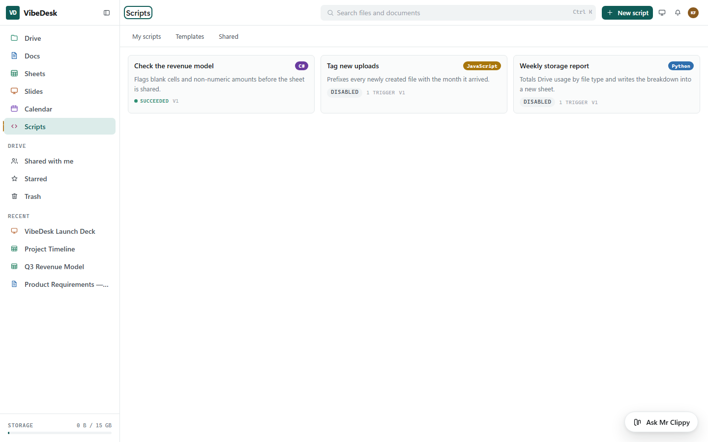
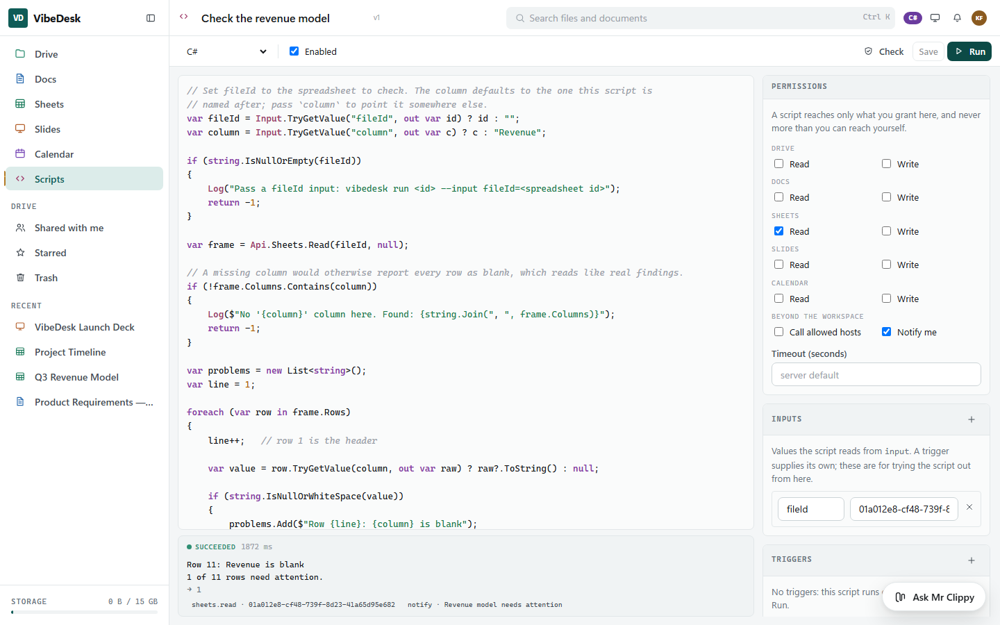
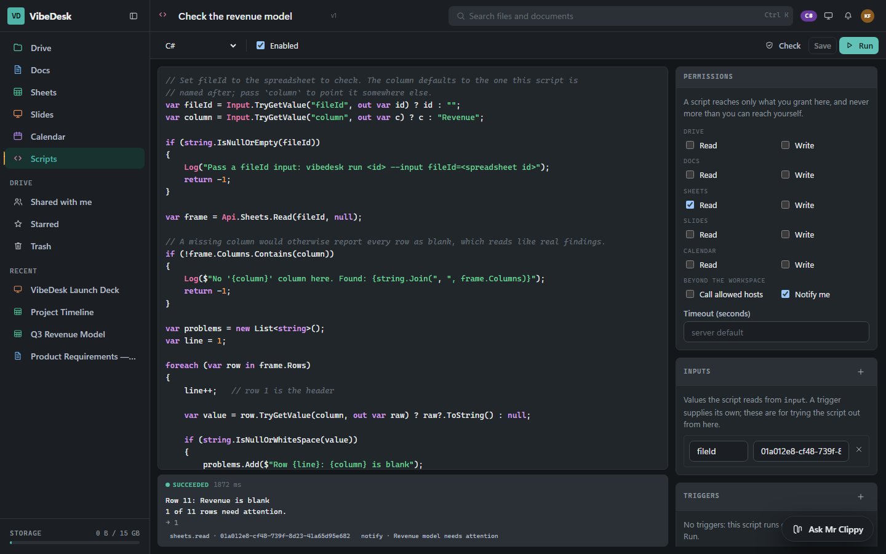
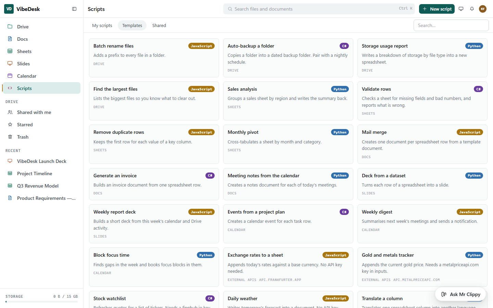

# Scripts and automation

[← README](../README.md) · [Architecture](architecture.md) · [Configuration](configuration.md) · [Apps](apps.md) · [API](api.md) · [Development](development.md)

Google Apps Script, except the language is your choice: **JavaScript, Python or C#**, against one
API that reaches Docs, Sheets, Slides, Calendar and Drive.

---

## What the user gets

- A web editor with syntax highlighting for all three languages
- One workspace API, identical in every language
- Permissions per script — a script that only reads Sheets can only read Sheets
- Triggers: on an event (a file changed, an event was created) or on a schedule
- A run history that records what the script *did*, not only whether it finished
- 23 templates across Drive, Sheets, Docs, Slides, Calendar and external APIs
- A place to share scripts with the rest of the workspace
- A CLI, so a script can run from a terminal or a build



Code sits on the left; everything that governs it sits on the right — the scopes it may use, the
triggers that fire it, the values it reads from `input`, and every run it has had.



---

## Choosing a language

| | Reach for it when | What it cannot do |
|---|---|---|
| **JavaScript** | Glue, JSON, quick web integration. The fastest to start. | Nothing notable — this is the default. |
| **Python** | Data shaping and analysis, and when the author already thinks in Python. | **No NumPy, no pandas** — see below. |
| **C#** | Typed logic, larger scripts, anything that mirrors server code. | Cannot be interrupted mid-loop — see below. |

The API surface is the same in all three. A script that filters a sheet reads the same in each; only
the syntax around it changes.

---

## The workspace API

Every language sees the same object. In JavaScript and Python it is `api`; in C# the members are in
scope directly.

```js
const frame  = api.sheets.read(fileId, 'Sheet1');            // SheetsRead - a DataFrame
const doc    = api.docs.read(fileId);                        // DocsRead
const events = api.calendar.events('2026-08-01', '2026-09-01'); // CalendarRead
const files  = api.drive.list(folderId);                     // DriveRead

api.sheets.appendRow(fileId, ['Nina', 42], 'Sheet1');        // SheetsWrite
api.sheets.create('Summary', frame);                         // SheetsWrite - a new spreadsheet
api.docs.append(fileId, '<p>Done.</p>');                     // DocsWrite
api.calendar.create({ title: 'Review', start: startsAt, end: endsAt }); // CalendarWrite
api.http.getJson('https://api.example.com/rates');           // Network
api.notify('The nightly report is ready');                   // Notify
```

JavaScript sees the members in camelCase; Python and C# use the .NET names (`api.Sheets.Read`).

**Every method is synchronous.** JavaScript and Python have no `await` here, so the host blocks
rather than handing back a promise nobody can resolve. Each call is timed and recorded.

### DataFrame, because pandas is not available

`api.Sheets.Read(...)` returns a `DataFrame`: `Where`, `SortBy`, `GroupBy`, `Pivot`, `Distinct`,
`Select`, `AddComputed`, `Head`, `Tail`, the `Sum`/`Average`/`Min`/`Max` aggregates, and `ToCsv`.
Filters are operator strings rather than callbacks (`frame.Where('amount', '>', 1000)`), which keeps
them identical across the three languages instead of three dialects of the same idea. Write one back
with `api.Sheets.WriteFrame(fileId, frame)` or turn it into a new spreadsheet with
`api.Sheets.Create(name, frame)`.

It exists because IronPython cannot load pandas — and rather than leave Python authors with less, the
capability is provided natively to everyone.

---

## Permissions

A script's scopes are stored **with the script**, not passed at the call site. Running it from the
editor, from a trigger, from the API or from the CLI all use the same grants; nothing can widen them
at run time.

| Scope | Grants |
|---|---|
| `DriveRead` / `DriveWrite` | List, read, create, rename, move, trash files |
| `DocsRead` / `DocsWrite` | Document content |
| `SheetsRead` / `SheetsWrite` | Cells and sheets |
| `SlidesRead` / `SlidesWrite` | Slides and their content |
| `CalendarRead` / `CalendarWrite` | Events |
| `Network` | Outbound HTTP, still only to the script's allowed hosts |
| `Notify` | A notification to the script's own owner |

Three things are true of every script regardless of scope:

- **A script can never reach what its owner cannot reach.** The scopes narrow the owner's own access;
  they never extend it. Every call goes through the same permission service the UI uses.
- **The Drive and document functions take no user id.** There is no parameter to tamper with.
- **`notify()` is addressed to the running user.** A script cannot choose whom to notify.

### Background runs act as the owner

A trigger fired by someone else's action still runs as the script's owner. If Sari edits a file that
Budi's script watches, the script runs with Budi's access — not Sari's, and not with none.

---

## Triggers

**Event triggers** hook onto activity that already existed. The scripting layer decorates
`IActivityService` and `ICollaborationNotifier` rather than editing any feature service, so Drive,
Docs and Calendar contain no code that knows scripts exist.

Available events: `item.created`, `item.updated`, `item.trashed`, `item.shared`, `content.saved`,
`event.created`, `event.updated`, `comment.added`.

The script reads what set it off from `input`:

| Key | Event triggers | Schedule triggers |
|---|---|---|
| `event` | the event name | `schedule` |
| `itemId` | the Drive item, when the event has one | — |
| `detail` | the activity description | — |
| `cron` | — | the expression that fired |
| `firedAt` | — | ISO 8601, UTC |

An event trigger without the item id would only be able to say that *something* changed, which is
rarely enough to act on. Write the handler to be idempotent: the same event can be delivered more
than once, and a script that prefixes a filename must check before prefixing it again.

The editor's **Inputs** panel supplies the same values by hand, so a script that expects a `fileId`
can be tried out before a trigger ever fires. The CLI does it with `--input key=value`.

**Schedule triggers** take a five-field cron expression (`0 9 * * 1-5`) plus the author's time zone.
The schedule is resolved in that zone, including across daylight-saving transitions, so "9am on
weekdays" stays 9am.

Both kinds are inert while the script is disabled — which is how every script starts, including one
installed from the shared list or created from a template.

---

## The sandbox, stated honestly

Each language is constrained differently, because each one gives away different things.

**JavaScript** runs on Jint, an interpreter written in .NET. It has no access to the CLR beyond the
objects handed to it. Memory, statement count and recursion depth are capped, and the cancellation
token is observed between statements. This is the strongest of the three by construction.

**Python** runs on IronPython. Dangerous modules (`clr`, `os`, `sys`, `subprocess`, `socket`,
`ctypes`, …) are refused in the source, the module search path is empty so `import` cannot reach the
filesystem, and a per-line trace hook stops a runaway loop at the next statement.

> **IronPython cannot load C extensions.** NumPy, pandas, SciPy and anything else with native code
> will not import. This is a property of the runtime, not a setting. `DataFrame` covers the tabular
> work those packages are usually reached for.

**C#** compiles through Roslyn to real IL with the framework in scope, so `File.Delete` is one line
away. It is therefore refused at *analysis time*, before anything runs: denied namespaces
(`System.IO`, `System.Diagnostics`, `System.Reflection`, `System.Net`, `System.Threading`, …),
denied types (`Environment`, `Activator`, `Type`, `Console`, …), plus `unsafe`, `stackalloc`,
P/Invoke and `dynamic`. Two layers do this — symbol resolution against the compilation, and a
name-only check that still works when a symbol fails to resolve.

> **The C# analysis is defence in depth, not a virtual-machine boundary.** It stops the direct routes
> and the obvious indirect ones. A determined attacker with a novel gadget is a different problem,
> and the answer to that one is process isolation. Treat the ability to author C# scripts as a
> privilege, not as something safe to hand to the public.

> **A C# script cannot be interrupted mid-loop.** .NET cannot abort a running thread. The executor
> races the run against its timeout plus a two-second grace; when the grace expires the run is
> reported as timed out and *the thread is abandoned* — it keeps going until it finishes on its own.
> A `while(true)` in C# therefore costs a thread until the process is recycled. JavaScript and Python
> do not have this problem; both stop at the next statement.



### Outbound HTTP

`Network` alone is not enough. A script also needs its host in the allowed list, and the host is
checked **after DNS resolution** against the address that came back — loopback, RFC1918 and
link-local addresses are refused. A hostname that resolves to `127.0.0.1` does not get through.

---

## The run history is the audit log

Every run records who or what triggered it, the script version that ran, its output, its result, its
error, and **every API call it made** with the target and whether it succeeded. A refused run is
recorded too, with the reason — "why did nothing happen" is exactly the question an audit log exists
to answer. The last 200 runs per script are kept.

---

## The CLI

```
vibedesk login [email]              Sign in and store a token
vibedesk config <url> [--key KEY]   Point at a server; an API key is the credential for automation
vibedesk list                       Your scripts
vibedesk run <file>                 Run a local file without saving it
vibedesk run <id> --input k=v       Run a saved script
vibedesk check <file>               Static check only, no execution
vibedesk push <file> [--id ID]      Save a local file as a script
vibedesk pull <id> [file]           Write a script's source to disk
vibedesk enable <id> / disable <id> Arm or disarm a script
vibedesk logs [id] [--take N]       Recent runs
vibedesk templates [keyword]        Browse the gallery
```

The language comes from the extension: `.js`, `.py`, `.csx`.

Two behaviours are deliberate. **`push` never enables a script** — writing code and arming it are
separate decisions, and a CLI that did both would arm a scheduled script the moment someone saved a
typo. **`push` without `--scope` leaves existing grants alone**, so pushing an edit does not silently
revoke what the script needs.

Credentials live in `~/.vibedesk/cli.json`, owner-only where the platform supports it. Prefer an API
key over the bearer token for anything unattended: tokens expire in an hour, and a key can be revoked
on its own.

```bash
vibedesk run report.py --scope SheetsRead --scope DriveWrite --input month=2026-08
```

Exit codes: `0` success, `1` a usage or connection problem, `2` the script ran and did not succeed —
so a build step can tell "could not reach the server" from "the script failed".

---

## Templates

23 of them, in six groups:

| Group | Examples |
|---|---|
| **Drive** | Batch rename, auto-backup a folder, storage usage report, find duplicates |
| **Sheets** | Validate a column, summarise by group, clean and dedupe, monthly rollup |
| **Docs** | Invoice from a spreadsheet row, mail merge, meeting notes from a calendar event |
| **Slides** | Deck from a dataset, chart-per-category deck |
| **Calendar** | Events from a project plan, weekly digest, free-slot finder |
| **External APIs** | Exchange rates, gold and commodity prices, stock quotes, translation, web search, weather |



Creating from a template gives you a disabled copy with the scopes it needs already ticked. Templates
that call an external service name the host they need and say where the API key goes.

---

## Configuration

```json
"Scripting": {
  "Enabled": true,
  "DefaultTimeoutSeconds": 30,
  "MaxTimeoutSeconds": 300,
  "MaxMemoryMb": 96,
  "MaxStatements": 5000000,
  "MaxOutputChars": 64000,
  "MaxRows": 50000,
  "MaxHttpResponseKb": 2048,
  "HttpTimeoutSeconds": 20,
  "MaxHttpCalls": 50,
  "MaxRunsPerScript": 200,
  "SchedulerIntervalSeconds": 30,
  "EnableScheduler": true,
  "MaxEventRunsPerMinute": 60
}
```

`Enabled: false` turns the whole subsystem off, including triggers already saved. The event queue is
bounded and rate-limited: a storm of file changes drops the excess rather than queueing work the
server will never catch up on.
